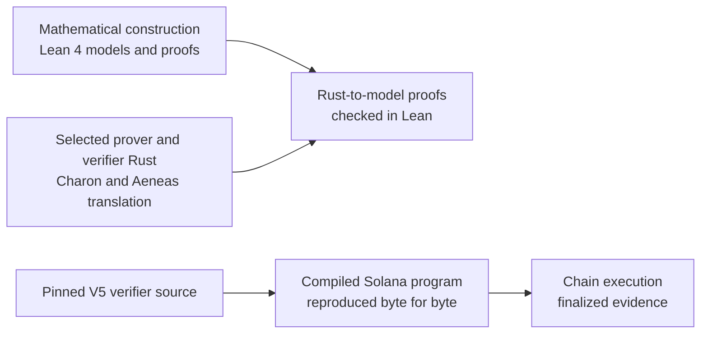

# Aspis

[](https://github.com/DJBarker87/aspis/actions/workflows/spend-integration.yml)

Aspis verifies a private spend and applies its state change entirely on
Solana, without a trusted setup. A user proves that a private record may be
spent under the pool's rules without publishing its secret data. The program
checks the proof, advances the pool, and records a one-time spent marker in one
transaction. Every check and update succeeds together, or nothing changes.

What makes Aspis unusual is the chain behind the transaction. Lean checks
substantial parts of the mathematics. Charon extracts selected production
Rust, Aeneas translates it into Lean, and bridge proofs show that the
extracted code agrees with the Lean models for the V5 release scope. The exact
compiled Solana program can then be reproduced from the pinned V5 build-source
commit and recorded build tools.



| Layer | What the repository establishes | Where to check it |
| --- | --- | --- |
| Mathematics | Lean checks the private-spend relation, release security calculations, group and hiding results, and models for current V5 verifier components | [formal-verification overview](docs/formal-verification.md) and [`AspisFormal/`](AspisFormal/) |
| Rust and Lean | Selected V5 production Rust is translated through Charon and Aeneas, then proved to agree with the Lean models for the stated release path | [`aeneas-verif/`](aeneas-verif/) |
| Source-to-program connection | The pinned V5 build-source commit and pinned tools reproduce the exact Solana program byte for byte | [V5 release preflight](release/preflight/v5-production-freeze.md) |
| Program-to-chain connection | V5 has a finalized devnet state transition; its mainnet transaction is pending. The earlier q18/g37 release has finalized mainnet evidence | [current status](#current-status) |

The code, proof artefacts, measurements, formal development, and security
argument are public for reproduction and review. The construction and its
limits are set out in the [paper](paper/aspis-spend/).

## Current status

Aspis now has two clearly separated release lines:

| Track | Status | Runtime result |
| --- | --- | ---: |
| q18/g37, tag 65 | [Executed and finalized](https://explorer.solana.com/tx/3G1voggszvDMGi5PbGM1kuEMYKvh2TNMbH6hHHwndUdRQJNT7ehRFpQpksxLnx5tp2xkS5jGi359rVXk42sRPFcv?cluster=mainnet-beta) on 2026-07-16 | 65,407-byte proof; 1,344,003 CU |
| V5, tag 67 | Finalized on devnet; ready for mainnet deployment | 1,335,952 CU landed; mainnet-runner policy limit 1,356,912 CU |

The machine-readable [release facts record](release/release-facts.json) is the
single source for release identities, hashes, transactions, runtimes, and
compute figures. CI checks the public release summary against it and rejects
known stale figures and statuses.

V5's default SBF is 1,258,496 bytes, SHA-256
`4cf3c1d5ddd47efa68875c0070247e007083c5c9bb2d5988db0d644a609edf40`,
and completed the full Tag-67 state transition on devnet at 1,335,952 CU:
[`38mNKeM…WtEuLC`](https://explorer.solana.com/tx/38mNKeMmRf9Ttqmde8jZqCMq8F1piHhCEqGYVYrSHEggTu21C93wWAEhoDkZ2qJHeTX7j3qCmibNNmZ6awWtEuLC?cluster=devnet).
The same binary was replayed across all three selectors and every accepted
marker pre-state on mainnet Agave 4.1.0. The topology calculation covers the
maximum tree shapes in the frozen replay family. Before submission, the runner
requires a canonical nullifier PDA bump of 255 and simulation of the exact
signed transaction bytes at or below 1,356,912 CU; the transaction compute
limit is the same. This gives
43,088 CU of policy headroom for the exact simulated transaction.

The [V5 preflight](release/preflight/v5-production-freeze.md),
[candidate bundle](release/aspis-v5-tag67-frozen-candidate-v1/), and
[current-runtime record](results/spend/v5-mainnet-runtime-4.1.0-20260723/)
hold the Rust-to-Lean proof, reproducible build, proof and statement, devnet
transition, runtime measurements, and rejected replay. The
[assumptions page](docs/assumptions-ledger.md) lists the remaining assumptions.

## What has been formally checked

Aspis has two connected formal-proof layers.
The [formal-verification overview](docs/formal-verification.md) explains how
they fit together and links each production path to its principal theorem.

### The mathematical construction

[`AspisFormal/`](AspisFormal/) is the maintained Lean 4 development. It checks
the private-spend relation and value-conservation core, the finite security
calculation used for the release parameters, circle-group and hiding results,
Poseidon2 known-answer bindings, and the Lean models for current V5 verifier
components. The detailed proof-status table distinguishes proved results from
named external cryptographic inputs.

### The production Rust

Charon extracts selected production V5 Rust paths, Aeneas translates them into
Lean, and the proofs in [`aeneas-verif/`](aeneas-verif/) show where the
generated definitions agree with the Lean models.

The proof covers the selected release schedule, the remaining verifier stages,
the public output, reading the Tag-67 work bytes, and all six ordered work
checks. The Tag-67 theorem retains one explicit code-to-model premise: the
production hash call must equal `HashFn` applied to the transcript state and
`DOM_GRIND || nonce_le64`. The
[formal-verification overview](docs/formal-verification.md) records the exact
coverage and theorem names.

## Previous mainnet result

The figures below describe the finalized q18/g37 mainnet feasibility result.

| Result | Value |
| --- | ---: |
| One-transaction verification and state transition | 1,344,003 of the 1,400,000-CU cap |
| Proof | 65,407 bytes |
| Soundness floor (work-normalized, proven Johnson/MCA regime) | ~100 bits |
| Zero knowledge (conditional computational, programmable ROM, declared view) | ~104-bit real-vs-simulator floor; ~103-bit pairwise witness-indistinguishability |
| Finalized slot | `433219840` |

The soundness floor is a per-query figure: after the Fiat–Shamir reduction and
a conservative whole-proof factor of three, the false-acceptance probability
is at most 2^−100.16 per random-oracle query. Like any grinding-based bound the
cumulative advantage grows with the query budget and goes vacuous past roughly
2^105 queries. The full event calculation, the per-budget table, and the complete
reduction are in the [paper](paper/aspis-spend/), recomputed by
`spend_soundness_epro_ledger`.

The floor is argument soundness: a satisfying witness exists. The
theft-resistance corollary additionally uses a named round-by-round knowledge
premise. The paper keeps the proved soundness statement and that extra
knowledge assumption separate.

## q18/g37 construction and transaction design

The next sections describe the finalized q18/g37 mainnet release. V5 keeps the
same overall proof-account and one-transaction state-update design with its
own proof format and release parameters.

### No trusted setup

Groth16 proofs are a few hundred bytes and cheap to verify, but their
soundness depends on a multi-party setup ceremony: a participant who retained
the ceremony's secret randomness could forge proofs, and a forged spend inside
a shielded pool is not detectable. Shielded pools on Solana today verify
ceremony-based Groth16 proofs or delegate proof verification to off-chain
systems ([comparison record](docs/novelty-rescan-2026-07-13.md)).

Aspis has no ceremony. Its parameters are public constants, and its security
reductions rest on the hash assumptions stated in the paper, a concrete
Poseidon2 assumption and SHA-256 modelled as a random oracle, rather than on a
reference string with a trapdoor. The cost is proof size: 65,407 bytes against
a few hundred for Groth16. Closing that size gap on-chain is what the
transaction design below is for.

### One transaction


A 65,407-byte proof exceeds Solana's 1,232-byte transaction packet limit, so
it is uploaded once and verified in place:

1. The prover uploads the proof in 69 chunks to a program-owned account.
2. The account is sealed after its complete byte image is checked against
   the released proof digest.
3. One transaction then verifies the sealed proof, advances the pool,
   records the one-time spent marker, and refunds the proof account. If any
   step fails, no state changes.

A spend therefore costs 71 setup transactions (proof-account create, 69 chunk
uploads, finalize) before the verification transaction, plus 2 per pool
(create, initialize). The proof account's rent is held from creation until the
verification transaction refunds it.

#### Throughput and scaling

Spends within one pool are strictly sequential. Each proof is ground against
the pool's current sequence number, and the pool account is writable-locked
during the verification transaction, so one pool processes one spend at a time
and each spend needs a freshly ground proof against the state the previous
spend produced. Per-pool throughput is bounded by prove-and-grind latency, not
by Solana. Horizontal scaling is by running multiple independent pools, which
fragments the anonymity set across pools, so the privacy of a spend is set by
the pool it lands in, not by the system as a whole. A shared cross-pool state
structure (a nullifier queue or tree in place of one PDA per spend) is not part
of this release.

Each spend also creates one canonical nullifier PDA that persists on-chain at
its rent minimum, so nullifier storage grows linearly with the number of
spends. The landed 1,344,003-CU transaction leaves 55,997 CU under the cap;
the release gate's 1,344,057-CU maximum leaves 55,943 CU. A runtime repricing
past that margin requires new parameters (see [Limitations](#limitations)).

### Construction

The parameters are chosen to fit complete verification under Solana's
compute-unit cap. The commitment layer is WHIR-style rather than FRI because
the cap prices verifier queries, not prover time.

- **Field.** M31 (p = 2³¹ − 1) with its circle group as the evaluation
  domain. Mersenne arithmetic is cheap on the 32-bit SBF target, and the
  degree-four extension QM31 supplies sampling soundness.
- **Hash.** Poseidon2 over M31 (width 16) for note commitments, nullifiers,
  and owner derivation, algebraic and so cheap inside the relation. SHA-256 is
  the Fiat–Shamir oracle because SBF exposes a native SHA-256 syscall.
- **Commitment.** A custom circle-domain, WHIR-style multilinear PCS: batched
  multilinear evaluation with four arity-four folds. It is not an invocation of
  an unmodified WHIR parameter set.
- **Rate.** 1/512 (2¹⁰ message rows to 2¹⁹ circle symbols). High blowup buys
  per-query soundness, so few queries are needed, which is what the
  compute-unit cap rewards.
- **Queries.** q = 18 per branch, sampled without replacement, with three
  query branches per attempt.
- **Grinding.** 37-bit batch work, per-fold work of 34/33/30/25 bits, and
  32-bit final work. Grinding supplies soundness bits that additional queries
  could not fit in the compute budget.
- **Lookup.** A 10-bit lookup table proves the 30-bit range decompositions
  that make the balance check an integer equality rather than an equality
  modulo p.

## Limitations

The limits define the next engineering and research steps; the paper gives the
full statements.

- **Knowledge.** The base theorem proves argument soundness. Theft resistance
  additionally uses the stated round-by-round extractor premise.
- **Application scope.** The q18/g37 release is one input, one output, one
  sequential pool, and a same-path replacement. It has no deposit or append
  path, so the demonstrated anonymity set was one.
- **Privacy scope.** The simulator covers the declared proof-and-execution view
  in the programmable SHA-256 random-oracle model. Fee-payer linkage,
  transaction graphs, network metadata, timing, and physical side channels are
  different privacy layers.
- **Deployment identity.** Statements bind the runtime program ID and an
  operator-selected domain tag. The executor checks the cluster genesis;
  including genesis directly in the statement would make that binding
  self-contained.
- **Operations.** Proof upload takes 71 preparatory transactions, one pool is
  sequential, nullifier storage grows linearly, and a CU repricing beyond the
  measured headroom would require new parameters.
- **Assurance.** The repository includes internal review, formal proofs,
  independent checkers, and finalized mainnet evidence. Independent
  cryptographic and Solana review and a published coverage-guided fuzz campaign
  are the next assurance milestones.

## Reproduce the evidence

### 1. Check the mathematical proofs

```bash
cd AspisFormal
lake exe cache get
lake build
```

### 2. Replay the Rust-to-Lean proofs

From the repository root:

```bash
aeneas-verif/component-c-runtime-downstream/released-trace-families-current-20260722/replay-lean432.sh
aeneas-verif/current-source-abc-capstone-20260722/replay-lean432.sh
```

These commands check the retained generated Lean and bridge proofs. The
[Aeneas replay notes](aeneas-verif/README.md#replaying-the-final-integration)
describe the authenticated dependency caches and tool locations they require.

### 3. Check the source and compiled program

```bash
cargo fmt --all -- --check
cargo check -q -p aspis-xtask
cargo test --release -q -p aspis-prover --test spend_release_kat
cargo test --release -q -p aspis-xtask spend_release
cargo run -q -p aspis-prover \
  --example spend_soundness_epro_ledger -- --calculation-only
cargo-build-sbf --manifest-path programs/aspis-verifier/Cargo.toml
```

The release-certified proof and statement are committed at
`crates/aspis-prover/fixtures/`; the known-answer test verifies them
end-to-end through the production verifier. The release pipeline
(`cargo run --release -p aspis-xtask -- spend-release`) regenerates the
machine-checked certificate gates from fresh local-validator measurements.

The V5 source-to-program reproduction, including the pinned Agave and
platform-tools archives, is recorded in the
[V5 release preflight](release/preflight/v5-production-freeze.md) and enforced
by the V5 reproducible-build workflow.

### 4. Check the release records

The finalized mainnet-beta execution is preserved in an offline-verifiable
bundle. From the repository root:

```bash
./release/aspis-spend-q18-g37-mainnet-v1/verify.sh
./release/aspis-v5-tag67-frozen-candidate-v1/verify.sh
python3 tools/check_release_facts.py
```

The bundle verifiers need only `jq` and `sha256sum` or `shasum`. They run
fully offline and check every published byte against `SHA256SUMS` and
`manifest.json`, including proof and SBF identities, release gates, and the
recorded chain evidence. The facts check also catches stale figures or status
claims elsewhere in the repository.

## Paper

The [paper source](paper/aspis-spend/) and adjacent PDF are the living
manuscript. The immutable q18/g37 publication PDF is
[`release/aspis-spend-q18-g37-mainnet-v1/paper/aspis-spend.pdf`](release/aspis-spend-q18-g37-mainnet-v1/paper/aspis-spend.pdf),
identical to the PDF attached to the GitHub Release. This keeps the executed
release record fixed while allowing the manuscript to document later formal
work.

## Origin

The starting point was Jotaro Yano's measurement study
([ePrint 2025/1741](https://eprint.iacr.org/2025/1741),
[solana-pqzk-fullchain](https://github.com/pqzk-labs/solana-pqzk-fullchain)),
which verified a minimal Winterfell STARK inside one Solana transaction on
devnet. Aspis began as a cost model calibrated against that verifier, then
asked whether the same budget could hold a real spend statement. The resulting
construction shares no components with the prototype, but the direction came
from Yano's paper.

Dominic Barker built Aspis as a solo research project, using AI-assisted
engineering throughout. The release includes checked code, versioned
artefacts, Lean proofs, and reproducible measurements. The
[novelty re-scan](docs/novelty-rescan-2026-07-13.md) records the dated
public-evidence search for the claim shape.

## Repository map

Concept-to-file navigation: [docs/code-map.md](docs/code-map.md). Each crate
carries a README naming its production entry points.

| Path | Contents |
| --- | --- |
| `.cargo/` | Reproducible Cargo aliases and build configuration |
| `.github/` | CI for Rust, release bindings, and Lean kernel checks |
| `AspisFormal/` | Lean proofs of the mathematical construction and release calculations |
| `aeneas-verif/` | Proofs that selected production Rust agrees with the Lean models |
| `crates/aspis-core/` | Shared verifier logic for the host and Solana program |
| `crates/aspis-prover/` | Code that creates proofs, runs grinding, and records release fixtures |
| `crates/aspis-statement/` | The private-spend rules and their byte encoding |
| `programs/aspis-verifier/` | The Solana program that checks proofs and updates state |
| `xtask/` | Release checks, measurements, and transaction execution |
| `paper/aspis-spend/` | Publication source and build instructions |
| `docs/` | Explanations, code navigation, evidence, and design history |
| `manifests/` | Machine-readable parameter and release bindings |
| `reference/` | Compact independent reference material |
| `release/` | Exact files and records for published releases and the V5 candidate |
| `results/` | Recorded runtime measurements and V5 chain evidence |
| `tools/` | Independent checking and release utilities |
| `archive/` | Index of superseded and failed research retained in Git |

Earlier prototypes, rejected parameters, failed designs, and the research
measurement harness are preserved in immutable archive tags rather than
presented as the current release; the [archive index](archive/README.md) lists
them.

Licensed under [MIT](LICENSE-MIT) or [Apache-2.0](LICENSE-APACHE); citation
metadata is in [CITATION.cff](CITATION.cff).
