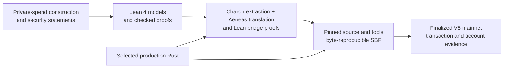

# Aspis

[](https://github.com/DJBarker87/aspis/actions/workflows/spend-integration.yml)

Aspis is a research implementation of a private spend on Solana. A user proves
that a private record can be spent under the pool's rules without publishing
the record, owner secret, value, or Merkle path. The program verifies the
proof, advances the pool, and records the public nullifier as spent atomically:
every check and write succeeds together, or none of them do. The proof system does
not require a trusted setup ceremony.

The result is more than one transaction. The repository connects the
mathematical construction to Lean proofs, selected production Rust, a
byte-reproducible Solana program, and finalized mainnet evidence.

## From mathematics to mainnet



| Evidence layer | What is established | Primary record |
| --- | --- | --- |
| Mathematics in Lean | Lean checks substantial parts of the spend rules, finite calculations, algebra, and component-level hiding arguments, subject to the assumptions named in each theorem | [formal-verification overview](docs/formal-verification.md) and [`AspisFormal/`](AspisFormal/) |
| Selected Rust to Lean | Charon and Aeneas translate selected Rust functions into Lean; further proofs compare those functions with the mathematical models, assuming that certain Rust inputs and intermediate values are the ones described by the models | [`aeneas-verif/`](aeneas-verif/) |
| Source to program bytes | A pinned clean source commit and pinned build tools reproduce the exact 1,258,496-byte V5 SBF | [V5 release preflight](release/preflight/v5-production-freeze.md) and [frozen candidate bundle](release/aspis-v5-tag67-frozen-candidate-v1/) |
| Program to chain | The deployed SBF identity, proof, statement, exact compute, state transition, and cleanup are preserved in a sanitized offline-verifiable bundle | [V5 mainnet bundle](release/aspis-v5-tag67-mainnet-v1/) |

These layers are complementary. A theorem about a model is not automatically a
theorem about every Rust instruction, and reproducible program bytes are not a
proof of their mathematics. Aspis records the links and their boundaries
instead of collapsing them into one broader claim.

## Mainnet result

On July 25, 2026 in Europe/Berlin (July 24 UTC), the current Aspis release
completed the full private-spend verification and state update on Solana
mainnet-beta. The finalized transaction:

- ran the deployed verifier's complete proof-checking path and accepted the
  75,358-byte proof;
- advanced the pool state;
- recorded the public nullifier as spent, so later transactions using that
  nullifier are rejected; and
- consumed 1,334,452 of Solana's 1,400,000-unit transaction limit.

[View the transaction](https://explorer.solana.com/tx/EJviPgF12i9iK2CveVaQSMeFQqDMFPQ1iPRUYEwNQE3zGquTUZNJXPZEENorcQtsnQj1orFmH1TPsgdbR3vJ2fE?cluster=mainnet-beta)
· [Check the release](release/aspis-v5-tag67-mainnet-v1/)
· [See formal coverage](docs/formal-verification.md)

The exact compiled program is tied to the recorded source and build
environment. The selected production verifier path is separately connected to
the maintained Lean models through the Charon/Aeneas proof layer.

The archived 75,358-byte proof also passes the released verifier callback in a
new regression test. The same test changes each of the nine public fields in
turn and confirms that every changed statement is rejected. This directly
checks the published proof and statement bytes; it does not replace the
general cryptographic soundness assumptions described below.

Because the proof account and ProgramData were closed after the demonstration,
the [full payer RPC archive](release/aspis-v5-tag67-mainnet-rpc-archive-v1/)
now reconstructs the exact proof from all 79 finalized uploads and the exact
SBF from all 1,466 finalized loader writes. Both reconstructed byte strings
match the released files. It also derives the full loader-v3 ProgramData image
and binds the released statement to the finalized Tag-67 instruction and pool
initialization.

### Exact technical record

| Item | Finalized V5 result |
| --- | --- |
| Verify-and-apply transaction | `EJviPgF…R3vJ2fE` |
| Finalized slot | `435019536` |
| Exact signed-wire simulation / landed compute | 1,334,452 CU / 1,334,452 CU |
| Transaction compute limit | 1,356,912 CU |
| Program | `7Q2nGsPg8rbjdxKHK4jxTgEWLTyd9o1X4KMSjCieRmue` |
| Nullifier | `7Umhkv2Z3E2DksnpivCz2tovtbRoL1uXtnYBAtQBgu8Q` |
| Nullifier PDA bump | 255 |
| SBF | 1,258,496 bytes; SHA-256 `4cf3c1d5ddd47efa68875c0070247e007083c5c9bb2d5988db0d644a609edf40` |

The recorded pre-execution source selected a nullifier with bump 255 and
required that value in the mainnet runner so PDA derivation stayed inside the
measured compute budget. The immutable lifecycle evidence records the landed
bump and transaction but does not pin the exact runner commit used. The exact
deployed program derived the PDA from the nullifier and required the supplied
account to match it, but it did not itself require the numeric bump to be 255.
That in-program restriction was added later. This distinction affects the
compute policy, not the validity of the landed proof or the rejection of a
second use of the same nullifier.

The exact mainnet wire simulated and landed at the same compute value, leaving
22,460 CU below its transaction limit and 65,548 CU below Solana's maximum.
After finality, three separate cleanup transactions closed the retained proof
account and ProgramData, then swept the payer. The pinned refund recipient
`configured refund recipient` received
10,980,894,882 lamports in total, and the payer ended at zero. The
[V5 mainnet record](docs/v5-mainnet-demo.md) preserves the deployment,
execution, cleanup, and refund receipts.

## What has been formally checked

Aspis has two connected formal layers:

1. [`AspisFormal/`](AspisFormal/) checks the maintained mathematical
   development in Lean 4.
2. Charon, Aeneas, and additional Lean proofs connect selected production V5
   Rust paths to those models.

The current Rust-to-Lean work covers the selected Component-A release
schedule, parts of Components B and C, the public output, the Tag-67 work-byte
reads, and the six ordered work checks. The final integration theorem assumes
that several Rust calls succeeded and that some Rust inputs, folded values,
and challenges equal the values in the Lean models. It does not prove that
every accepted production proof automatically meets those assumptions or
satisfies the complete spend relation. The exact theorem name is recorded in
the [technical proof map](docs/formal-verification.md#current-v5-coverage).

Lean now proves that a normalized residual package satisfies every spend rule,
including value balance, ownership, both Merkle paths, the nullifier, the
output note, the asset, the fee, and all six public spend fields. That package
already includes the typed hash inputs, path sharing, and public-field matches;
it is not the raw proof bytes. What is not yet proved is that every proof
accepted by the production program yields that package with the claimed error
bound.

`V5DeployedFalseAcceptance.lean` now states a precise conditional probability
step. It takes three caller-supplied definitions of failure intended to
describe the selector branches and proves their union bound. If those
definitions are proved to be the actual deployed branch failures, accepted
runs extract valid traces outside them, the Poseidon2 model is faithful, and
the existing width, round, transcript, commitment, Fiat--Shamir, and per-branch
assumptions hold, Lean
derives a work-normalized false-acceptance probability at most `2^-100`. The
corresponding ordinary probability is at most `min(1, T / 2^100)` for query
budgets `1 <= T <= 2^128`. None of those deployed or cryptographic premises is
proved by this new theorem.

The theft proof no longer treats the compressing nullifier hash as one-to-one.
The new fixed-victim game covers recovery of the victim's credential, a
different secret/randomness pair with the victim's nullifier, a different
opening of the victim's note commitment, and a different leaf at the victim's
exact tree position. Lean proves that the last case exposes a concrete
Poseidon2 node-hash collision. A different path at a different tree position
can be a normal opening and is therefore not incorrectly called a collision.
The complete bound also lists PDA aliasing, Solana runtime/state failure, and
an invalid victim setup as separate events.

This completes the case split for the attack event defined in the Lean model,
but not the connection from every real attack to that event or its numerical
security. The connection from the exact deployed Tag-67 program to the
mathematical game, multi-proof extraction, concrete Poseidon2 bounds, PDA
security, and Solana runtime guarantees remain external. No standalone V5
theft-resistance number is claimed.

This is deliberately a bounded claim. It is not an end-to-end formal proof of
every Rust function, the compiler, Solana, or the complete private-spend
system. The Tag-67 work-checking theorem retains one explicit hash-call
assumption: the production transcript hash call must equal the Lean hash
function on the transcript state and `DOM_GRIND || nonce_le64`. Other parts
retain the assumptions summarized above.
Cryptographic assumptions, untranslated code, extraction, compilation, and
runtime trust are listed in the [assumptions ledger](docs/assumptions-ledger.md).

The current mathematical review found no concrete forgery or broken finite
calculation. It did find that the V5 soundness claim, deployed hiding, and
theft resistance still depend on major unproved links: the listed failure
cases must cover every false proof, the cited papers must apply to this exact
protocol, and the real Rust run must match the Lean model. The q18/g37
100.161-bit value is a work-normalized
per-query case-study result, not a raw forgery probability or a silently
inherited V5 security level. See the
[mathematical status review](docs/reviews/mathematical-status-20260814.md).

The [formal-security extension
review](docs/reviews/v5-formal-security-extension-20260814.html) gives the
shortest plain-English account of the new results and the work still open.

The [formal-verification overview](docs/formal-verification.md) gives the
precise theorem map, coverage, and remaining boundaries.

## What the result demonstrates

Aspis shows that a transparent private-spend proof and its all-or-nothing pool
and spent-marker update can complete within one Solana transaction after the
proof has been uploaded and sealed. More distinctively, it publishes
separately checkable links from the mathematical model, through selected
production verifier paths, to exact compiled bytes and their finalized
mainnet execution.

The evidence does not turn those links into one universal theorem. The formal,
translation, compiler, runtime, and cryptographic boundaries remain explicit
at the point where each claim depends on them.

## What this release does not provide

- **Application scope.** V5 demonstrates one input, one output, and one
  sequential pool. It does not provide deposits, multiple inputs or outputs, a
  wallet, or a growing privacy set; the demonstrated anonymity set was one.
- **Throughput.** A pool processes spends sequentially, and proving plus
  proof-of-work grinding dominates latency. Horizontal scaling uses separate
  pools and therefore fragments anonymity.
- **Storage.** Each spend leaves one program-derived nullifier account on-chain, so
  nullifier storage grows linearly.
- **Proof size and operations.** The proof needs 79 upload transactions before
  sealing. Temporary rent must be funded and later recovered.
- **Security model.** The arguments use named assumptions for Poseidon2,
  SHA-256, Fiat–Shamir, and knowledge extraction. Network metadata, timing,
  fee-payer linkage, transaction graphs, and physical side channels are
  outside the proved privacy view.
- **Demonstration secret.** The published transaction used a newly sampled
  demonstration witness, not a user's funded private note. Each secret field
  came from operating-system randomness. The recorded artifact-builder source
  discarded candidates until the nullifier PDA had bump 255. The witness was
  not published or retained,
  so the transaction demonstrates that the released program accepted and
  applied the archived proof bytes rather than custody of a real asset.
- **Assurance.** The repository contains formal proofs, tests, reproducible
  builds, internal review, and finalized chain evidence, but it has not
  received an external cryptographic or Solana security audit.

The [paper](paper/aspis-spend/) states the construction and security claims in
full.

## How the transaction works

The 75,358-byte V5 proof is too large for a Solana transaction packet, so it
is uploaded to a temporary program-owned account and sealed before use. The V5
lifecycle comprised 84 transactions:

- 2 pool setup transactions;
- 1 proof-account create;
- 79 proof uploads;
- 1 Tag-62 seal; and
- 1 Tag-67 verify-and-apply transaction.

Deployment and the three cleanup transactions are separate from that count.
During Tag 67, the proof account is read-only and retained so the result can be
recorded before a separate authorized close. The pool and nullifier account
are writable. Validation and complete proof verification precede every state
write.

[How Aspis works](docs/how-it-works.md) explains the statement, upload
lifecycle, atomic state transition, and cleanup in plain language.

## Reproduce the evidence

### 1. Check the mathematical Lean development

```bash
cd AspisFormal
lake exe cache get
lake build
```

### 2. Replay the selected Rust-to-Lean proofs

From the repository root:

```bash
aeneas-verif/component-c-runtime-downstream/released-trace-families-current-20260722/replay-lean432.sh
aeneas-verif/current-source-abc-capstone-20260722/replay-lean432.sh
```

The [Aeneas replay notes](aeneas-verif/README.md#replaying-the-final-integration)
describe the authenticated dependency caches and pinned tool locations.

### 3. Check the exact program and frozen release inputs

```bash
./release/aspis-v5-tag67-frozen-candidate-v1/verify.sh
```

For a byte-for-byte rebuild, follow the pinned source, Agave, platform-tools,
and provenance record in the
[V5 release preflight](release/preflight/v5-production-freeze.md).

### 4. Check the finalized mainnet lifecycle

```bash
./release/aspis-v5-tag67-mainnet-v1/verify.sh
python3 tools/check_release_facts.py
```

These checks are offline. They verify the published proof and statement,
frozen SBF reference, lifecycle receipts, compute values, cleanup accounting,
and public release claims against the committed manifests and hashes.

## Repository map

| Path | Purpose |
| --- | --- |
| `AspisFormal/` | Maintained Lean models and mathematical proofs |
| `aeneas-verif/` | Charon/Aeneas translations and Rust-to-model bridge proofs |
| `crates/aspis-core/` | Shared fields, transcript, proof format, commitments, and verifier arithmetic |
| `crates/aspis-statement/` | Private-spend statement and relation |
| `crates/aspis-prover/` | Prover, grinding, release fixtures, and security calculators |
| `programs/aspis-verifier/` | Solana program, V5 dispatch, account checks, and atomic update |
| `xtask/` | Reproducibility gates, deployment, recovery journal, and cleanup tools |
| `release/` | Frozen candidate inputs and finalized public release bundles |
| `results/` | Runtime measurements, build provenance, and supporting evidence |
| `docs/` | Explanations, assumptions, code navigation, reviews, and release history |
| `paper/aspis-spend/` | Full construction and security argument |

The detailed [code map](docs/code-map.md) links concepts to production entry
points.

## Historical result

The earlier q18/g37 Tag-65 feasibility release remains preserved as history.
Its finalized mainnet transaction
[`3G1vog…RPFcv`](https://explorer.solana.com/tx/3G1voggszvDMGi5PbGM1kuEMYKvh2TNMbH6hHHwndUdRQJNT7ehRFpQpksxLnx5tp2xkS5jGi359rVXk42sRPFcv?cluster=mainnet-beta)
consumed 1,344,003 CU on 2026-07-16. Its design, proof, and immutable bundle
are documented in the [q18/g37 mainnet record](docs/mainnet-demo.md). V5 is
the current result.

## Project

Dominic Barker built Aspis as a solo research project using AI-assisted
engineering. Earlier prototypes and rejected designs remain in the
[archive index](archive/README.md). Citation metadata is in
[CITATION.cff](CITATION.cff).

Licensed under [MIT](LICENSE-MIT) or [Apache-2.0](LICENSE-APACHE).
