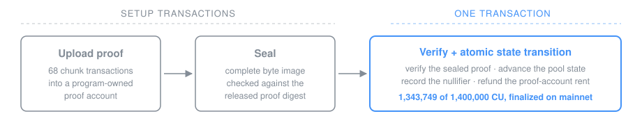

# Aspis

[](https://github.com/DJBarker87/aspis/actions/workflows/spend-integration.yml)

Aspis is a transparent shielded-spend verifier for Solana L1: no trusted
setup, no off-chain verifier. Transparent proofs are large, and Solana caps
every transaction at 1.4 million compute units, which has kept transparent
proof verification on L1 out of reach. Aspis Spend, the q18/g37 release in
this repository, verifies a full shielded-spend proof, advances the pool
state, and records the nullifier in one transaction under that cap.

This release is the spend-verification primitive, not a complete payment
system. It proves a one-input/one-output same-path leaf replacement in a
depth-20 tree and applies the atomic pool and nullifier state transition.
There is no deposit instruction; notes are assumed already present, and the
anonymity set does not grow. The mainnet execution below advanced one pool
from sequence 0 to 1.

On 2026-07-16 Aspis Spend verified a shielded-spend proof, advanced the pool
state, and recorded the nullifier in one finalized mainnet-beta transaction
at 1,344,003 CU:
[`3G1vogg…sRPFcv`](https://explorer.solana.com/tx/3G1voggszvDMGi5PbGM1kuEMYKvh2TNMbH6hHHwndUdRQJNT7ehRFpQpksxLnx5tp2xkS5jGi359rVXk42sRPFcv?cluster=mainnet-beta).
The program was a disposable deployment, closed after the run, so there is no
standing instance to call ([evidence](docs/mainnet-demo.md)).

This is a research release, not an audit or a production service. The exact
claim, model, and limitations are in the [paper](paper/aspis-spend/) and in
[Limitations](#limitations). The
[novelty re-scan](docs/novelty-rescan-2026-07-13.md) is a dated
public-evidence search for the claim shape.

## Release numbers

| Result | Value |
| --- | ---: |
| One-transaction verification and state transition | 1,344,003 of the 1,400,000-CU cap |
| Proof | 65,407 bytes |
| Soundness floor (work-normalized, proven Johnson/MCA regime) | 100.16 bits |
| Work to forge (expected random-oracle queries) | ≈ 2^106.79 |
| Zero knowledge (conditional computational, programmable ROM, declared view) | 104.024-bit real-vs-simulator floor; 103.024-bit pairwise witness-indistinguishability floor |
| Finalized slot | `433219840` |

Soundness is reported as three numbers rather than one so nothing is hidden
in the reduction:

1. **Round/event-ledger error** ≈ 2^−106.79, the conservative union of the
   protocol's per-event error before the Fiat–Shamir reduction.
2. **Raw false-acceptance advantage as a function of the query budget T.** An
   adversary making T random-oracle queries falsely accepts with probability
   at most `3·[(T + 32)·2^−106.79 + 3(T² + 1)/2^256]`. This grows with T and
   goes vacuous once T approaches the round error, as every grinding-based
   bound does:

   | Query budget T | Raw false-acceptance bound |
   | ---: | ---: |
   | 2^40 | ≤ 2^−65.21 |
   | 2^64 | ≤ 2^−41.21 |
   | 2^80 | ≤ 2^−25.21 |
   | 2^100 | ≤ 2^−5.21 |
   | ≈ 2^105.2 and beyond | vacuous (no guarantee) |

3. **The 100.16-bit floor**, the per-query bound uniform over 1 ≤ T ≤ 2^128
   after the 32-boundary BCS reduction and a conservative whole-ledger factor
   of three: the false-acceptance probability per random-oracle query is at
   most 2^−100.16.

The floor is a per-query figure, and the table is the cumulative per-budget
bound behind it; the two measure different things and should not be read as
a single 2^−100 forgery probability. All three come from the soundness ledger
and are recomputed by `spend_soundness_epro_ledger`.

The 100.16-bit floor is argument soundness: a satisfying witness exists. Under
one added premise, a round-by-round *knowledge* analogue of the
state-restoration premise that posits a straight-line extractor, assumed
rather than proved, the argument is an argument of knowledge. Because the
public nullifier binds a note to its spending secret, that gives **conditional
theft resistance**: any party producing an accepting spend of a note must know
its secret, except with the stated soundness error, and this holds even
against an adversary that has seen honest spends (see [Limitations](#limitations)).
The whole guarantee rests on that one unproved knowledge premise, so it is not
a cleared production security claim; no funds should be placed in a pool on the
basis of this release.

## No trusted setup

Groth16 proofs are a few hundred bytes and cheap to verify, but their
soundness depends on a multi-party setup ceremony: a participant who retained
the ceremony's secret randomness could forge proofs, and a forged spend inside
a shielded pool is not detectable. Shielded pools on Solana today verify
ceremony-based Groth16 proofs or delegate proof verification to off-chain
systems ([comparison record](docs/novelty-rescan-2026-07-13.md)).

Aspis has no ceremony. Its parameters are public constants, and its security
reductions rest on the hash assumptions stated in the paper, a concrete
Poseidon2 assumption and SHA-256 modelled as a random oracle, rather than on a
reference string with a trapdoor. The cost is proof size: 65,407 bytes against
a few hundred for Groth16. Closing that size gap on-chain is what the
transaction design below is for.

## One transaction



A 65,407-byte proof exceeds Solana's 1,232-byte transaction packet limit, so
it is uploaded once and verified in place:

1. The prover uploads the proof in 69 chunks to a program-owned account.
2. The account is sealed after its complete byte image is checked against
   the released proof digest.
3. One transaction then verifies the sealed proof, advances the pool,
   records the nullifier, and refunds the proof account, atomically. If any
   step fails, no state changes.

A spend therefore costs 71 setup transactions (proof-account create, 69 chunk
uploads, finalize) before the verification transaction, plus 2 per pool
(create, initialize). The proof account's rent is held from creation until the
verification transaction refunds it.

### Throughput and scaling

Spends within one pool are strictly sequential. Each proof is ground against
the pool's current sequence number, and the pool account is writable-locked
during the verification transaction, so one pool processes one spend at a time
and each spend needs a freshly ground proof against the state the previous
spend produced. Per-pool throughput is bounded by prove-and-grind latency, not
by Solana. Horizontal scaling is by running multiple independent pools, which
fragments the anonymity set across pools, so the privacy of a spend is set by
the pool it lands in, not by the system as a whole. A shared cross-pool state
structure (a nullifier queue or tree in place of one PDA per spend) is not part
of this release.

Each spend also creates one canonical nullifier PDA that persists on-chain at
its rent minimum, so nullifier storage grows linearly with the number of
spends. The 1,344,003-CU verification leaves 55,997 CU of headroom under the
cap (about 4%), so the parameters do not survive a runtime compute-unit
repricing that raises this workload past the cap (see
[Limitations](#limitations)).

## Construction

The parameters are chosen to fit complete verification under Solana's
compute-unit cap. The commitment layer is WHIR-style rather than FRI because
the cap prices verifier queries, not prover time.

- **Field.** M31 (p = 2³¹ − 1) with its circle group as the evaluation
  domain. Mersenne arithmetic is cheap on the 32-bit SBF target, and the
  degree-four extension QM31 supplies sampling soundness.
- **Hash.** Poseidon2 over M31 (width 16) for note commitments, nullifiers,
  and owner derivation, algebraic and so cheap inside the relation. SHA-256 is
  the Fiat–Shamir oracle because SBF exposes a native SHA-256 syscall.
- **Commitment.** A custom circle-domain, WHIR-style multilinear PCS: batched
  multilinear evaluation with four arity-four folds. It is not an invocation of
  an unmodified WHIR parameter set.
- **Rate.** 1/512 (2¹⁰ message rows to 2¹⁹ circle symbols). High blowup buys
  per-query soundness, so few queries are needed, which is what the
  compute-unit cap rewards.
- **Queries.** q = 18 per branch, sampled without replacement, with three
  query branches per attempt.
- **Grinding.** 37-bit batch work, per-fold work of 34/33/30/25 bits, and
  32-bit final work. Grinding supplies soundness bits that additional queries
  could not fit in the compute budget.
- **Lookup.** A 10-bit lookup table proves the 30-bit range decompositions
  that make the balance check an integer equality rather than an equality
  modulo p.

## Limitations

Each limitation is recorded in the paper's limitations section.

- **Theft resistance is conditional on one unproved knowledge premise.** The
  base soundness theorem gives only that a satisfying witness exists. The
  theft-resistance corollary (a party producing an accepting spend must know
  the note's secret, since the public nullifier binds the note to it) rests on
  a round-by-round *knowledge* premise positing a straight-line extractor,
  assumed rather than proved. It is heavier than, but the same epistemic status
  as, the soundness state-restoration premise it mirrors. The deployed-pool
  setting, where the adversary has also seen honest spends, is covered by
  *proving* the compiled argument has weak unique responses (from
  statement-first Fiat–Shamir absorption, salts bound into leaves, and a
  three-value selector) and invoking the published Fiat–Shamir
  simulation-extractability theorem; the extra error terms are a Merkle
  second-preimage and a birthday collision over the simulated proofs, both of
  the order already in the soundness ledger. Theft resistance is therefore a
  conditional guarantee, not a production-cleared one, and it says nothing
  about key management or secret-key leakage.
- **No deposit path; anonymity set does not grow.** This release ships the
  spend verifier only. There is no deposit, mint, or append-leaf instruction;
  the pool's starting anchor is supplied at initialization rather than
  accumulated from deposits, and the relation replaces a leaf in place rather
  than adding one. The demonstrated spend advanced one pool from sequence 0 to
  1, so its anonymity set is one. A deposit construction and a growing set are
  future work.
- **Single-note, single-pool.** One input, one output, one pool account, one
  nullifier PDA per spend, strictly sequential (see
  [Throughput and scaling](#throughput-and-scaling)). Multi-input/output,
  change/merge, and a shared nullifier structure are not in this release.
- **Cross-cluster isolation rests on an operator-chosen tag.** The statement
  binds a deployment domain,
  `sha256("aspis-spend-deployment-domain-v1" || runtime_program_id ||
  domain_tag)`, stored by the pool at initialization and compared, with a
  distinct error code, before any proof byte is interpreted. A proof ground for
  one deployment is rejected by every pool storing another domain. Two gaps
  remain. The binding is keyholder-shaped: the holder of the program-id keypair
  can redeploy the same program id with the same domain tag on another cluster
  and reproduce the domain. And the domain tag is an operator-supplied label
  that the program does not check against the cluster genesis, so a pool
  initialized on one cluster with another cluster's tag produces that cluster's
  domain. Cross-cluster isolation therefore rests on the operator choosing an
  honest tag, verified by the off-chain executor's genesis check rather than
  enforced by the program. Binding the cluster genesis into the domain would
  remove the second gap; it is not in this release because it would require
  regenerating the proof.
- **Zero knowledge is conditional and model-scoped.** The paper constructs a
  witness-free simulator (Theorem "real view versus simulation") whose output
  is computationally indistinguishable from the real proof view. It holds only
  under the affine-image rank and coverage premise, in the programmable SHA-256
  random-oracle model, and for the declared proof-and-execution view, which
  excludes the fee-payer identity, blockhash, account-graph linkage, network
  metadata, and timing/scheduler/power side channels. It is computational, not
  statistical, perfect, or standard-model zero knowledge, and it is not
  transaction-graph or network-layer privacy. The affine-image rank premise is
  independently checkable with `tools/verify_hiding_ranks.py`, which re-derives
  the maps with its own field arithmetic and reproduces the eight pinned ranks
  rather than taking the prover's word for them.
- **No external audit; no live instance.** No third-party security audit or
  coverage-guided fuzz campaign has been performed
  ([internal review](docs/reviews/prepublication-security-review.md)). The
  mainnet program was disposable and is closed; there is no standing deployment
  to call.
- **Compute-unit repricing.** Runtime CU pricing differs across clusters and
  changes over time. A repricing past the cap halts spends at these parameters,
  since the executor's same-cluster preflight simulation fails closed before
  submission, and it cannot admit invalid state.

## Verify the source

```bash
cargo fmt --all -- --check
cargo check -q -p aspis-xtask
cargo test --release -q -p aspis-prover --test spend_release_kat
cargo test --release -q -p aspis-xtask spend_release
cargo run -q -p aspis-prover \
  --example spend_soundness_epro_ledger -- --calculation-only
cargo-build-sbf --manifest-path programs/aspis-verifier/Cargo.toml
```

The release-certified proof and statement are committed at
`crates/aspis-prover/fixtures/`; the known-answer test verifies them
end-to-end through the production verifier. The release pipeline
(`cargo run --release -p aspis-xtask -- spend-release`) regenerates the
machine-checked certificate gates from fresh local-validator measurements.

## Verify the release

The finalized mainnet-beta execution is frozen in an offline-verifiable
bundle. From the repository root:

```bash
./release/aspis-spend-q18-g37-mainnet-v1/verify.sh
```

It needs only `jq` and `sha256sum` or `shasum`, runs fully offline, and checks
every published byte against `SHA256SUMS` and `manifest.json`, the proof and
SBF container magics, the release-certificate gates, and the finalized on-chain
signature, slot, and compute units.

## Paper

The [paper source](paper/aspis-spend/) states the exact relation, transcript,
and security reductions, with measured release values flowing through
`macros-generated.tex`. The PDF is rebuilt, frozen, and hash-pinned when a
release executes.

## Repository map

Concept-to-file navigation: [docs/code-map.md](docs/code-map.md). Each crate
carries a README naming its production entry points.

| Path | Contents |
| --- | --- |
| `crates/aspis-core/` | `no_std`, byte-exact host and SBF verifier core |
| `crates/aspis-prover/` | Prover, grinding, security calculators, and the release proof fixtures |
| `crates/aspis-statement/` | Shielded-spend relation and statement encoding |
| `programs/aspis-verifier/` | Wire format, dispatch, lifecycle, verification, and atomic state transition |
| `xtask/` | Release certification, measurement, and deployment execution |
| `paper/aspis-spend/` | Publication source and build instructions |
| `docs/` | Novelty search record and design history |
| `archive/` | Index of superseded and failed research retained in Git |

Earlier prototypes, rejected parameters, failed designs, and the research
measurement harness are preserved in immutable archive tags rather than
presented as the current release; the [archive index](archive/README.md) lists
them.

Licensed under [MIT](LICENSE-MIT) or [Apache-2.0](LICENSE-APACHE); citation
metadata is in [CITATION.cff](CITATION.cff).
