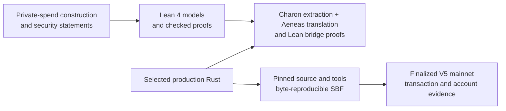

# Aspis

[](https://github.com/DJBarker87/aspis/actions/workflows/spend-integration.yml)

Aspis is a research implementation of a private spend on Solana. A user proves
that a private record can be spent under the pool's rules without publishing
the record, owner secret, value, or Merkle path. The program verifies the
proof, advances the pool, and records the public nullifier as spent atomically:
every check and write succeeds together, or none of them do. The proof system does
not require a trusted setup ceremony.

The result is more than one transaction. The repository connects the
mathematical construction to Lean proofs, selected production Rust, a
byte-reproducible Solana program, and finalized mainnet evidence.

## From mathematics to mainnet



| Evidence layer | What is established | Primary record |
| --- | --- | --- |
| Mathematics in Lean | Lean checks substantial parts of the spend rules, finite calculations, algebra, and component-level hiding arguments, subject to the assumptions named in each theorem | [formal-verification overview](docs/formal-verification.md) and [`AspisFormal/`](AspisFormal/) |
| Selected Rust to Lean | Charon and Aeneas translate selected Rust functions into Lean. The final accepted-path theorem follows one successful translated verifier call through the transcript, work, queries, authenticated openings, FRI execution, relation checks, and both final accumulators. Its clean tracked replay passed on 24 August 2026 | [`aeneas-verif/`](aeneas-verif/) |
| Source to program bytes | A pinned clean source commit and pinned build tools reproduce the exact 1,258,496-byte V5 SBF | [V5 release preflight](release/preflight/v5-production-freeze.md) and [frozen candidate bundle](release/aspis-v5-tag67-frozen-candidate-v1/) |
| Program to chain | The deployed SBF identity, proof, statement, exact compute, state transition, and cleanup are preserved in a sanitized offline-verifiable bundle | [V5 mainnet bundle](release/aspis-v5-tag67-mainnet-v1/) |

These layers are complementary. A theorem about a model is not automatically a
theorem about every Rust instruction, and reproducible program bytes are not a
proof of their mathematics. Aspis records the links and their boundaries
instead of collapsing them into one broader claim.

### Current proof-integration status

The final one-run theorem passed its clean tracked replay on 24 August 2026.
One successful selected translated call to the released V5
proof checker deterministically yields the maintained accepted-path
security-event conclusion. The proof derives the general accumulator's exact
terminal weights and dot product, and the compact accumulator's constructor,
four folds, final assembly, and dot product, from that same execution. Those
equalities are internal results, not assumptions supplied by the theorem's
caller.

One model link remains outside that theorem. The translated Rust checks that
the live statement and its digest agree, but the proof does not yet identify
each field of that Rust statement with the abstract public-statement object
used by the mathematical false-acceptance and theft models. That missing link
does not make the recorded proof arbitrary; it limits the claim that the
deterministic source theorem is already a fully instantiated deployed-theft
theorem.

An audit found that the previous handwritten Lean outer wrapper reconstructed
the compact array from an empty iterator, so its writes were discarded. This
was a proof-artifact error, not a Rust or deployed-program error. Lean now
contains both a small counterexample for the old wrapper and a corrected
wrapper that reconstructs the array from the updated original iterator. An
extended Aeneas translation of the unchanged Rust function now produces the
correct iterator handback. The final proof connects that generated caller to
the fold semantics rather than assuming their equality.

This deterministic theorem does not supply the cryptographic or platform
premises needed for an unconditional numerical security claim.
The stronger wrapper works for any terminal evaluator because later security
reasoning does not consume that evaluator's value; it also installs the
released FRI tables internally. The SHA-256 callback and primitive security,
Poseidon2 security, published decoding, PCS/FRI and Fiat--Shamir
applicability, extraction, compiler, Solana runtime, and numerical event
budgets remain explicit. The deterministic classification has not yet been
lifted into the probability space used by the conditional 100-bit theorem.
No new transaction is needed because this work checks the already released
source.

## Mainnet result

On July 25, 2026 in Europe/Berlin (July 24 UTC), the deployed Aspis program ran
the complete V5 verifier, accepted the archived 75,358-byte proof, and applied
the state update on Solana mainnet-beta. The finalized transaction:

- executed the entire deployed V5 verifier, which returned acceptance for
  the 75,358-byte archived proof;
- advanced the pool state;
- recorded the public nullifier as spent, so later transactions using that
  nullifier are rejected; and
- consumed 1,334,452 of Solana's 1,400,000-unit transaction limit.

[View the transaction](https://explorer.solana.com/tx/EJviPgF12i9iK2CveVaQSMeFQqDMFPQ1iPRUYEwNQE3zGquTUZNJXPZEENorcQtsnQj1orFmH1TPsgdbR3vJ2fE?cluster=mainnet-beta)
· [Check the release](release/aspis-v5-tag67-mainnet-v1/)
· [See formal coverage](docs/formal-verification.md)

The exact compiled program is tied to the recorded source and build
environment. Subject to the clean final replay described above, the
Charon/Aeneas proof layer connects one successful selected production-verifier
call to the maintained accepted-path security-event conclusion. Both final
accumulator equalities are derived inside that proof.

The archived 75,358-byte proof also passes the released verifier callback in a
new regression test. The same test changes each of the nine public fields in
turn and confirms that every changed statement is rejected. This directly
checks the published proof and statement bytes; it does not replace the
general cryptographic soundness assumptions described below.

Because the proof account and ProgramData were closed after the demonstration,
the [full payer RPC archive](release/aspis-v5-tag67-mainnet-rpc-archive-v1/)
now reconstructs the exact proof from all 79 finalized uploads and the exact
SBF from all 1,466 finalized loader writes. Both reconstructed byte strings
match the released files. It also derives the full loader-v3 ProgramData image
and binds the released statement to the finalized V5 verification instruction and pool
initialization.

### Exact technical record

| Item | Finalized V5 result |
| --- | --- |
| Verify-and-apply transaction | `EJviPgF…R3vJ2fE` |
| Finalized slot | `435019536` |
| Exact signed-wire simulation / landed compute | 1,334,452 CU / 1,334,452 CU |
| Transaction compute limit | 1,356,912 CU |
| Program | `7Q2nGsPg8rbjdxKHK4jxTgEWLTyd9o1X4KMSjCieRmue` |
| Nullifier | `7Umhkv2Z3E2DksnpivCz2tovtbRoL1uXtnYBAtQBgu8Q` |
| Nullifier PDA bump | 255 |
| SBF | 1,258,496 bytes; SHA-256 `4cf3c1d5ddd47efa68875c0070247e007083c5c9bb2d5988db0d644a609edf40` |

The recorded pre-execution source selected a nullifier with bump 255 and
required that value in the mainnet runner so PDA derivation stayed inside the
measured compute budget. The immutable lifecycle evidence records the landed
bump and transaction but does not pin the exact runner commit used. The exact
deployed program derived the PDA from the nullifier and required the supplied
account to match it, but it did not itself require the numeric bump to be 255.
That in-program restriction was added later. This distinction affects the
compute policy, not the validity of the landed proof or the rejection of a
second use of the same nullifier.

The exact mainnet wire simulated and landed at the same compute value, leaving
22,460 CU below its transaction limit and 65,548 CU below Solana's maximum.
After finality, three separate cleanup transactions closed the retained proof
account and ProgramData, then swept the payer. The pinned refund recipient
`configured refund recipient` received
10,980,894,882 lamports in total, and the payer ended at zero. The
[V5 mainnet record](docs/v5-mainnet-demo.md) preserves the deployment,
execution, cleanup, and refund receipts.

## What has been formally checked

Aspis has two connected proof layers. [`AspisFormal/`](AspisFormal/) contains
the mathematical development. Charon, Aeneas, and further Lean proofs connect
the selected accepting production verifier path to those models.

For the released V5 proof callback, the checked source chain starts from one
successful translated verifier execution. It currently derives, from that
same run:

- the parsed proof and public statement values;
- the transcript challenges and all six work checks;
- the exact ordered set of 18 query positions;
- the five authenticated opening sections and the values read from them;
- the four FRI folds and final four-coefficient polynomial; and
- the exact 76 decoded point claims, their four prepared claims, and the
  resulting initial relation value; and
- the complete 58-field decoded relation tail and four accepted relation
  rounds.

Those facts are not supplied as unrelated Rust/model equality assumptions.
The final theorem also derives the accepted general accumulator schedule and
terminal dot, together with the compact accumulator's constructor, folds,
final assembly, and dot. Its clean tracked replay passed on 24 August 2026, so the complete
deterministic connection from one successful translated verifier call to the
maintained accepted-path security-event conclusion is established. The
[accepted-path source map](docs/v5-accepted-source-map.md) gives the short
review route, and the [formal-verification overview](docs/formal-verification.md)
lists the exact theorem and replay boundary.

Lean separately checks the private-spend rules, including value balance,
ownership, both Merkle paths, the nullifier, output note, asset and fee fields,
and public statement. It also checks the released circle domains and encoders,
the coherent four-fold FRI candidate argument, the challenge-dependent
nineteen-word reduction, and the bounded distinct-query sampler. The published
circle-decoding and Fiat--Shamir theorems remain cited inputs; Lean checks that
their stated field, distance, degree, and query conditions match the release.

The release target is **100 bits of work-normalized attack cost**. The checked
protocol subtotal is below `0.7 * 2^-100`, leaving `0.3 * 2^-100` for explicit
external events. If an attacker is considered only after completing the
37-bit grind, the dominant raw term is about 70–71 bits. Aspis does not describe
that raw term as 100-bit security.

The completed source theorems do not verify Charon, Aeneas, Lean, the Rust/SBF compiler,
Solana, SHA-256, or Poseidon2. It also does not turn the separate production
zero-knowledge and numerical theft arguments into unconditional claims. The
published cryptographic results, concrete primitive-security bounds, fresh
prover randomness, source-to-binary toolchain, and Solana account and
persistence behavior remain explicit assumptions. The surrounding atomic
state and refund path has its own source and runtime boundary.

The fixed-victim theft model avoids assuming that a compressing nullifier hash
is one-to-one. It separates credential recovery, a second nullifier preimage,
a second note opening, a Merkle collision at the victim's position, marker
address behavior, invalid setup, and Solana runtime failure. A concrete
deployed theft number still needs extraction and primitive/runtime bounds, so
the repository does not claim an unconditional standalone theft-resistance
number.

No concrete mathematical forgery or accepting invalid proof was found. The
complete boundary is recorded in the [assumptions ledger](docs/assumptions-ledger.md)
and [security policy](SECURITY.md).

## What the result demonstrates

Aspis shows that a transparent private-spend proof and its all-or-nothing pool
and spent-marker update can complete within one Solana transaction after the
proof has been uploaded and sealed. More distinctively, it publishes
separately checkable links from the mathematical model, through selected
production verifier paths, to exact compiled bytes and their finalized
mainnet execution.

The evidence does not turn those links into one universal theorem. The formal,
translation, compiler, runtime, and cryptographic boundaries remain explicit
at the point where each claim depends on them.

## What this release does not provide

- **Application scope.** V5 demonstrates one input, one output, and one
  sequential pool. It does not provide deposits, multiple inputs or outputs, a
  wallet, or a growing privacy set; the demonstrated anonymity set was one.
- **Throughput.** A pool processes spends sequentially, and proving plus
  proof-of-work grinding dominates latency. Horizontal scaling uses separate
  pools and therefore fragments anonymity.
- **Storage.** Each spend leaves one program-derived nullifier account on-chain, so
  nullifier storage grows linearly.
- **Proof size and operations.** The proof needs 79 upload transactions before
  sealing. Temporary rent must be funded and later recovered.
- **Security model.** The arguments use named assumptions for Poseidon2,
  SHA-256, Fiat–Shamir, and knowledge extraction. Network metadata, timing,
  fee-payer linkage, transaction graphs, and physical side channels are
  outside the proved privacy view.
- **Demonstration secret.** The published transaction used a newly sampled
  demonstration witness, not a user's funded private note. Each secret field
  came from operating-system randomness. The recorded artifact-builder source
  discarded candidates until the nullifier PDA had bump 255. The witness was
  not published or retained,
  so the transaction demonstrates that the released program accepted and
  applied the archived proof bytes rather than custody of a real asset.
- **Assurance.** The repository contains formal proofs, tests, reproducible
  builds, internal review, and finalized chain evidence, but it has not
  received an external cryptographic or Solana security audit.

The [formalization report](paper/aspis-formalization/) states the proof scope
and security assumptions in full. The earlier
[construction paper](paper/aspis-spend/) records the protocol and deployment
design.

## How the transaction works

The 75,358-byte V5 proof is too large for a Solana transaction packet, so it
is uploaded to a temporary program-owned account and sealed before use. The V5
lifecycle comprised 84 transactions:

- 2 pool setup transactions;
- 1 proof-account create;
- 79 proof uploads;
- 1 proof-account seal; and
- 1 V5 verify-and-apply transaction.

Deployment and the three cleanup transactions are separate from that count.
During V5 verification, the proof account is read-only and retained so the result can be
recorded before a separate authorized close. The pool and nullifier account
are writable. The deployed callback completes all of its checks and returns
acceptance before any state write.

[How Aspis works](docs/how-it-works.md) explains the statement, upload
lifecycle, atomic state transition, and cleanup in plain language.

## Reproduce the evidence

### 1. Check the mathematical Lean development

```bash
cd AspisFormal
lake exe cache get
lake build
```

### 2. Replay the selected Rust-to-Lean proofs

From the repository root:

Use the Lean 4.32 aggregate replay under
`aeneas-verif/v5-result-aware-source-link-20260821/`. It checks the tracked
accepted-path proof closure and its generated-source dependencies. Until the
two dot-product equalities above are closed, this is a checkpoint replay, not
a replay of a completed end-to-end theorem.

The [Aeneas replay notes](aeneas-verif/README.md#replaying-the-accepted-path-checkpoint)
describe the authenticated dependency caches and pinned tool locations.

### 3. Check the exact program and frozen release inputs

```bash
./release/aspis-v5-tag67-frozen-candidate-v1/verify.sh
```

For a byte-for-byte rebuild, follow the pinned source, Agave, platform-tools,
and provenance record in the
[V5 release preflight](release/preflight/v5-production-freeze.md).

### 4. Check the finalized mainnet lifecycle

```bash
./release/aspis-v5-tag67-mainnet-v1/verify.sh
python3 tools/check_release_facts.py
```

These checks are offline. They verify the published proof and statement,
frozen SBF reference, lifecycle receipts, compute values, cleanup accounting,
and public release claims against the committed manifests and hashes.

## Repository map

| Path | Purpose |
| --- | --- |
| `AspisFormal/` | Maintained Lean models and mathematical proofs |
| `aeneas-verif/` | Charon/Aeneas translations and Rust-to-model bridge proofs |
| `crates/aspis-core/` | Shared fields, transcript, proof format, commitments, and verifier arithmetic |
| `crates/aspis-statement/` | Private-spend statement and relation |
| `crates/aspis-prover/` | Prover, grinding, release fixtures, and security calculators |
| `programs/aspis-verifier/` | Solana program, V5 dispatch, account checks, and atomic update |
| `xtask/` | Reproducibility gates, deployment, recovery journal, and cleanup tools |
| `release/` | Frozen candidate inputs and finalized public release bundles |
| `results/` | Runtime measurements, build provenance, and supporting evidence |
| `docs/` | Explanations, assumptions, code navigation, reviews, and release history |
| `paper/aspis-formalization/` | Formalization report and exact security boundary |
| `paper/aspis-spend/` | Earlier construction and deployment paper |

The [accepted V5 source map](docs/v5-accepted-source-map.md) gives auditors a
15-stop path through the released verifier. The broader [code
map](docs/code-map.md) links concepts to production entry
points.

## Historical result

The earlier q18/g37 Tag-65 feasibility release remains preserved as history.
Its finalized mainnet transaction
[`3G1vog…RPFcv`](https://explorer.solana.com/tx/3G1voggszvDMGi5PbGM1kuEMYKvh2TNMbH6hHHwndUdRQJNT7ehRFpQpksxLnx5tp2xkS5jGi359rVXk42sRPFcv?cluster=mainnet-beta)
consumed 1,344,003 CU on 2026-07-16. Its design, proof, and immutable bundle
are documented in the [q18/g37 mainnet record](docs/mainnet-demo.md). V5 is
the current result.

## Project

Dominic Barker built Aspis as a solo research project using AI-assisted
engineering. Earlier prototypes and rejected designs remain in the
[archive index](archive/README.md). Citation metadata is in
[CITATION.cff](CITATION.cff).

Licensed under [MIT](LICENSE-MIT) or [Apache-2.0](LICENSE-APACHE).
