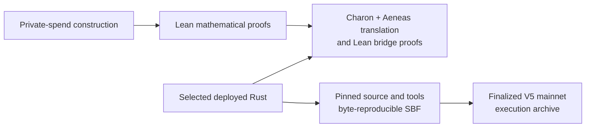

# Aspis

[](https://github.com/DJBarker87/aspis/actions/workflows/spend-integration.yml)

Aspis is a transparent, computationally hiding private-spend verifier for
Solana with an end-to-end formal proof of its deployed successful path. To our
knowledge, following a public-evidence search completed on 24 August 2026, it
provides the first publicly evidenced Solana mainnet transaction to directly
verify a trusted-setup-free private-spend proof and atomically record the
corresponding nullifier and new pool state within the transaction compute
limit.

The final transaction verified a 75,358-byte proof in 1,334,452 compute units.
The 1,258,496-byte Solana program is byte-reproducible from the pinned source
and tools. For every successful call through the functional translation of
the deployed Rust proof checker, Lean derives the exact parse, byte
transcript, work checks, query schedule, authenticated openings, four
low-degree folds, complete algebraic relation, and both terminal accumulator
equalities from that same execution.

## End-to-end accepted-path verification

The publication theorem covers every successful translated execution of the
deployed proof checker. Its clean Lean 4.32 replay passed on 24 August 2026
over all 331 tracked modules in the accepted-path closure. Exact declaration
names are kept in the [artifact guide](paper/aspis-formalization/ARTIFACT.md).

From any successful translated call, the proof derives:

- the parsed proof body and live public statement;
- every Fiat-Shamir challenge and all six ordered work checks;
- the exact 18 distinct query positions;
- all five Merkle-authenticated opening sections and the values consumed from
  them;
- the four FRI folds, coordinate calculations, and final four-coefficient
  polynomial;
- the exact 76 decoded point claims, four prepared claims, and initial
  relation value;
- the complete 58-field relation tail and four accepted relation rounds;
- the twelve-component general accumulator, its terminal weights, and final
  dot product; and
- the compact accumulator constructor, four folds, final assembly, and
  four-term dot product.

Every value comes from the same accepted execution. Neither accumulator
equality is supplied by the theorem's caller. The authenticated low-degree and
relation evidence is derived directly, so the proof does not rely on a final
helper's return value as a summary of unchecked work.

The [formal-verification overview](docs/formal-verification.md) gives the
theorem map, and the [15-stop source map](docs/v5-accepted-source-map.md)
provides the shortest audit route through the Rust and Lean artifacts.

## Mathematics, source, binary, chain

Aspis publishes four independently checkable evidence layers:



| Layer | Published result | Primary record |
| --- | --- | --- |
| Mathematical model | Lean checks the private-spend relation, exact release arithmetic, circle domains and encoders, coherent four-fold FRI argument, distinct-query sampler, hiding reductions, theft reductions, and spent-marker model | [`AspisFormal/`](AspisFormal/) |
| Deployed accepted path | Generated Lean plus bridge proofs connect every successful selected Rust verifier execution end to end through both final accumulators | [`aeneas-verif/`](aeneas-verif/) |
| Source to SBF | Pinned source and build tools reproduce the exact 1,258,496-byte program | [V5 preflight](release/preflight/v5-production-freeze.md) |
| SBF to mainnet | The archived proof, statement, program bytes, transaction, state change, compute use, and cleanup are offline-verifiable | [V5 mainnet bundle](release/aspis-v5-tag67-mainnet-v1/) |

The formal theorem covers the selected accepted proof-checker callback. Its
named trust boundary consists of the SHA-256 callback, published decoding and
Fiat-Shamir results, Poseidon2 and SHA-256 security, Charon/Aeneas and the Lean
kernel, compilation, and Solana runtime semantics. Two further composition
theorems would connect the Rust public-statement fields to the abstract theft
game and lift the deterministic accepted-call classification into the
work-normalized probability experiment. The
[assumptions ledger](docs/assumptions-ledger.md) records these interfaces once
with their supporting evidence.

## Security result

Lean proves an exact finite failure decomposition and the arithmetic used by
the V5 release. The release target is **100 bits of work-normalized attack
cost**:

\[
  B_{\mathrm{protocol}} \le 0.7\cdot 2^{-100},\qquad
  B_{\mathrm{external}} \le 0.3\cdot 2^{-100}
  \Longrightarrow B_{\mathrm{total}} \le 2^{-100}.
\]

The external budget covers the explicitly named primitive, Fiat-Shamir,
extraction, toolchain, and runtime events. For an attacker evaluated only
after completing the 37-bit grind, the dominant raw term is about 70--71 bits;
the paper reports that raw figure separately from the work-normalized target.

The recent Poseidon2 algebraic attacks improve prior attack estimates but do
not publish a break of the Aspis parameter set. Aspis therefore treats
Poseidon2-M31 width 16, `alpha = 5`, 8 full rounds, and 14 partial rounds as a
named primitive-security assumption and does not assign it an unsupported
concrete advantage.

## Mainnet result

On 25 July 2026 in Europe/Berlin (24 July UTC), the deployed V5 program
completed proof verification and the atomic state update on Solana
mainnet-beta:

- transaction:
  [`EJviPgF...R3vJ2fE`](https://explorer.solana.com/tx/EJviPgF12i9iK2CveVaQSMeFQqDMFPQ1iPRUYEwNQE3zGquTUZNJXPZEENorcQtsnQj1orFmH1TPsgdbR3vJ2fE?cluster=mainnet-beta);
- finalized slot: `435019536`;
- proof: 75,358 bytes;
- landed compute: 1,334,452 CU under the 1,400,000-CU network limit;
- program: `7Q2nGsPg8rbjdxKHK4jxTgEWLTyd9o1X4KMSjCieRmue`;
- nullifier account: `7Umhkv2Z3E2DksnpivCz2tovtbRoL1uXtnYBAtQBgu8Q`;
- SBF: 1,258,496 bytes, SHA-256
  `4cf3c1d5ddd47efa68875c0070247e007083c5c9bb2d5988db0d644a609edf40`.

The proof and program accounts were later closed. The
[full payer RPC archive](release/aspis-v5-tag67-mainnet-rpc-archive-v1/)
reconstructs the exact proof from 79 finalized uploads and the exact SBF from
1,466 finalized loader writes. Both reconstructed byte strings match the
release bundle. The [V5 mainnet record](docs/v5-mainnet-demo.md) gives the
complete lifecycle and cleanup receipts.

## Methodology

The verification was built in the same order as the runtime data flow:

1. Specify the public statement, private witness, transcript bytes, five
   opening trees, FRI schedule, relation, and state transition in Lean.
2. Prove the release-specific mathematics, including the linked four-fold
   candidate argument and finite security ledger.
3. Extract focused deployed Rust with Charon and translate it with Aeneas.
4. Prove generated-source bridges for each consumer boundary, always carrying
   values from one accepted execution.
5. Compose the bridges into the accepted-call theorem and audit its axiom
   report.
6. Reproduce the deployed SBF from pinned source and tools.
7. Bind the archived program, proof, statement, and finalized state transition
   with offline-verifiable hashes and receipts.

This organization makes the proof reviewable at the same boundaries where
data changes representation: Rust bytes, generated Lean values, maintained
mathematical objects, compiled SBF, and finalized chain state.

## Reproduce the result

### Mathematical development

```sh
cd AspisFormal
lake exe cache get
lake build
```

### End-to-end accepted-path theorem

```sh
aeneas-verif/scripts/replay-accepted-path-lean432.sh
```

The replay resolves the exact tracked dependency closure, rejects proof
escapes such as `sorry`, prepares the pinned Aeneas revision, builds the Lean
theorem, and audits its axiom output.

### Frozen program identity

```sh
./release/aspis-v5-tag67-frozen-candidate-v1/verify.sh
```

### Finalized mainnet lifecycle

```sh
./release/aspis-v5-tag67-mainnet-v1/verify.sh
python3 tools/check_release_facts.py
python3 release/aspis-v5-tag67-mainnet-rpc-archive-v1/verify.py
```

## Release profile

V5 demonstrates one private input, one private output, one sequential pool,
and one persistent nullifier account per spend. The proof is uploaded and
sealed before verification in 79 chunks; the full spend lifecycle uses 84
transactions. The public privacy view includes the statement and proof
transcript, while fee-payer linkage, network metadata, timing, and physical
side channels remain application-level concerns. The mainnet transaction used
a freshly sampled demonstration witness and an anonymity set of one.

## Repository map

| Path | Purpose |
| --- | --- |
| `AspisFormal/` | Maintained Lean mathematical development |
| `aeneas-verif/` | Charon/Aeneas outputs and source-to-model bridge proofs |
| `crates/aspis-core/` | Fields, transcript, proof format, commitments, and verifier arithmetic |
| `crates/aspis-statement/` | Private-spend statement and relation |
| `crates/aspis-prover/` | Prover, grinding, fixtures, and security calculators |
| `programs/aspis-verifier/` | Solana verifier, account checks, and atomic update |
| `release/` | Frozen binary inputs and finalized evidence bundles |
| `paper/aspis-formalization/` | Current formalization and security paper |
| `docs/` | Methodology, assumptions, code maps, and release records |

An earlier feasibility transaction used 1,344,003 compute units and remains
available in the [historical mainnet record](docs/mainnet-demo.md). The later
transaction and end-to-end theorem described above are the publication result.

## Citation and license

The current paper is [the Aspis formalization report](paper/aspis-formalization/).
Citation metadata is in [CITATION.cff](CITATION.cff). Dominic Barker built
Aspis as a solo research project using AI-assisted engineering.

Licensed under [MIT](LICENSE-MIT) or [Apache-2.0](LICENSE-APACHE).
