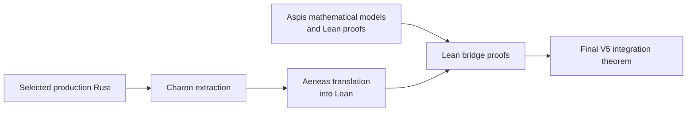

# How Aspis is formally checked

Aspis has two connected proof layers. The first uses Lean 4 to check the
mathematical construction. The second uses Charon, Aeneas, and additional Lean
proofs to connect selected production Rust to those Lean models.

This matters because a proof about a model does not, by itself, show that a
program implements the model. Aspis records both the mathematical results and
the implementation connection for the stated release scope.



## The mathematical proof layer

The [`AspisFormal`](../AspisFormal/) project checks substantial parts of the
construction, including:

- the private-spend relation, value conservation, range conditions, and
  commitment and Merkle clauses;
- the concrete security arithmetic and work-normalized bounds used by the
  published parameter sets;
- circle-group, masking, and hiding results;
- known-answer executions over pinned Poseidon2 constants, with separate CI
  binding those constants to Rust;
- the maintained models for Components A, B, and C of the V5 verifier;
- exact 17-attempt retry control and nonce/work authentication.

The [`AspisFormal` status
table](../AspisFormal/README.md) gives the principal module and proof status
for each result. It also distinguishes results proved directly from those
proved relative to named cryptographic interfaces.

The audited integration theorems use Lean and mathlib's standard logical base,
`{propext, Classical.choice, Quot.sound}`. The maintained project contains no
`sorry`, custom axiom, `native_decide`, or compiled-evaluation shortcut.

## Connecting Rust to the mathematics

The Rust-to-model proof layer follows four steps:

1. Charon extracts selected production V5 Rust paths from the prover and
   verifier.
2. Aeneas translates the extracted Rust definitions into Lean.
3. Lean bridge proofs connect those generated definitions to the Aspis
   mathematical models.
4. The final integration theorem packages the selected Component-A schedule,
   Components B and C, the public output, and the Tag-67 work verifier under
   their stated execution and input hypotheses.

The retained Component A, B, C, and work-byte definitions come from extracted
Rust. Pinned Aeneas cannot translate the `Transcript` function-pointer field,
so the six-step control-flow proof uses a small proof-facing Rust helper
supplied with the six booleans computed by the production digest checks.
Separate theorems prove the digest predicate. The exact hash-call equality
remains the one premise stated below.

## Current V5 coverage

| Production path | What the proof establishes | Principal theorem |
| --- | --- | --- |
| Component A | Extracted matrix execution agrees with the Lean GoodA model for the selected release schedule | `FormalClosureStream1.component_a_actual_matches_maintained` |
| Component B | The generated sampler, evaluator, and C2 layout agree with the ten-round Lean model | `FormalClosureStream1.component_b_actual_matches_maintained` |
| Component C | The four runtime rounds, finalization, packer, and public rows agree with the deployed evaluator model | `generated_public_run_output_matches_deployed` |
| Tag-67 work bytes and checks | The generated guards and little-endian reads produce the decoded work view used by Lean, and the proof-facing chain preserves the batch, four fold, and final check order | `AspisTag67WorkVerifierClosure.tag67AcceptedWireAndVerifierClosure` |
| Final V5 composition | Packages the selected Component-A result, Component B, Component C public output, and Tag-67 work verification under their stated execution and canonical-input hypotheses | `FormalClosureStream1.current_source_combined_capstone` |

The final integration theorem is in
[`CurrentSourceABCapstone.lean`](../aeneas-verif/current-source-abc-capstone-20260722/proof/CurrentSourceABCapstone.lean).
The Component-C public-output theorem is in
[`RuntimeReleasedTraceFamiliesCurrentJoin.lean`](../aeneas-verif/component-c-runtime-downstream/released-trace-families-current-20260722/proof/RuntimeReleasedTraceFamiliesCurrentJoin.lean).
The Tag-67 theorem is in
[`Tag67WorkVerifierClosure.lean`](../aeneas-verif/tag67-work-wire-correspondence/proof/Tag67WorkVerifierClosure.lean).

The exact extraction snapshots, bridge modules, and theorem map are in the
[`aeneas-verif` technical theorem map](../aeneas-verif/README.md).

## The remaining Tag-67 hash-call equality

The Tag-67 implementation theorem has one Rust-to-model premise:

```text
∀ state nonce,
  actualTranscriptGrindingDigest state nonce =
    rustHash state ((3 : Byte) :: List.ofFn (nonceLEBytes nonce))
```

It states that the actual transcript hash function call equals the Lean hash
interface applied to the transcript state, the `DOM_GRIND` domain byte
`3`, and the nonce encoded as little-endian bytes.

Given successful generated work-byte guards and reads, the exact projection,
leading-zero predicate, and six ordered work checks are conclusions of the
theorem rather than added code-to-model premises. SHA-256 security remains a
cryptographic assumption recorded in the
[`assumptions page`](assumptions-ledger.md).

## Exact scope

The Component-A Rust proof is established for the selected release
schedule. The Component-B, Component-C, public-output, Tag-67 decoding, and
ordered-work results have the broader scopes stated in their theorem ledgers.

Lean checks the selected translations and bridge theorems. Pinned extraction,
compilation, and runtime records bind the remaining trusted tools to the
release. The combined theorem connects the listed Component A, B, C, and
work-byte models; it is not an end-to-end Rust proof for every verifier
function or the complete private-spend relation. The full list of proved and
trusted links is in the [assumptions page](assumptions-ledger.md).

## Reproduce the checks

Build the maintained mathematical proof layer:

```sh
cd AspisFormal
lake exe cache get
lake build
```

From the repository root, replay the pinned Lean 4.32 Rust-to-model proof
packages:

```sh
aeneas-verif/component-c-runtime-downstream/released-trace-families-current-20260722/replay-lean432.sh
aeneas-verif/current-source-abc-capstone-20260722/replay-lean432.sh
```

The retained translations were produced with pinned Charon and Aeneas
revisions. These commands check the generated Lean and bridge proofs under
Lean's default limits; the combined replay requires the authenticated
dependency caches described in the
[`aeneas-verif` replay notes](../aeneas-verif/README.md#replaying-the-final-integration)
along with its tool-location options.
