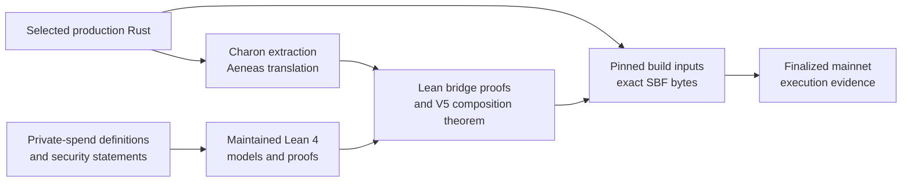

# How Aspis is formally checked

Aspis V5 combines mathematical proofs, implementation proofs, reproducible
build evidence, and finalized chain evidence. These are different claims, so
the repository keeps their boundaries visible.



The arrows do not mean that one proof automatically covers the next layer.
They identify the evidence used to connect adjacent layers.

## Layer 1: the mathematical development

[`AspisFormal/`](../AspisFormal/) is the maintained Lean 4 project. It checks
substantial parts of the construction, including:

- the private-spend relation, value conservation, range conditions, and the
  deterministic commitment and Merkle equations once the checked trace rows
  have been extracted;
- the historical q18/g37 finite arithmetic and work-normalized calculation,
  plus the corrected V5 width-19/degree-18 arithmetic and exact post-`m0`
  round accounting;
- circle-group, masking, and hiding results;
- known-answer executions over the pinned Poseidon2 constants, with CI binding
  the same constants to Rust;
- maintained models for V5 Components A, B, and C; and
- the 17-attempt production retry controller and nonce/work authentication.

The detailed [`AspisFormal` proof-status
table](../AspisFormal/README.md) names the principal module for each result and
separates proved conclusions from named cryptographic inputs.

The audited integration theorems use Lean and mathlib's standard logical base,
`{propext, Classical.choice, Quot.sound}`. The maintained project contains no
`sorry`, custom axiom, `native_decide`, or compiled-evaluation shortcut.

### Accepted proof to spend relation: exact status

`V5AcceptedSpendRelation.lean` proves the deterministic half of this claim.
It starts from a normalized residual package containing the arithmetic
residuals, typed Poseidon2 inputs, the eleven checked two-round steps of each
permutation, both twenty-level Merkle paths with shared bits and siblings, and
the exact six public spend-field matches. Lean constructs the full
private-spend relation from those facts, assuming `Poseidon2Faithful`. The
package is already a structured interpretation of the trace, not raw proof
bytes.

It does **not** yet prove that arbitrary Tag-67 acceptance yields those facts.
That remaining theorem must connect the decoded Rust execution to the
committed trace, prove the copy and LogUp constraints, apply polynomial
commitment and FRI extraction, bind every public input, and give a probability
bound for Fiat--Shamir, collision, and zero-denominator failures. The current
accepted-run theorem leaves that whole step as an explicit premise and warns
that choosing an always-true failure event would prove nothing.

### Theft resistance: exact status

`TheftResistance.lean` models a fixed prover execution and a fixed target
nullifier. Its execution record may contain the prover and random-oracle query
transcript needed by an extractor; it is not just the serialized proof.
`V5TheftResistance.lean` then instantiates the result with the exact V5 public
fields and complete spend relation, deriving the nullifier equality from that
relation rather than assuming it. Lean proves:

```text
Pr[accepted prover execution yields the wrong extracted secret]
    <= Pr[extractor failure]
       + Pr[target second preimage for the victim's nullifier]
```

This replaces the old, impossible assumption that the compressing nullifier
hash is globally one-to-one. A second Lean reduction covers a different valid
opening of the exact same fixed input leaf by reducing it to extraction failure
or a second preimage of the combined owner-and-note commitment. The reductions
are not yet a complete computational theft game: they do not formalize
efficient algorithms, the attacker's view, target-note sampling, or the
deployed verifier. A deployed numerical claim also needs the acceptance-to-
extraction and after-observed-proofs results, fixed-target security for the
nullifier and combined note commitment, a Merkle-binding reduction for an
alternative leaf or path, and the code-to-model connection for all of them.

## Layer 2: selected production Rust

A mathematical model can be correct while its implementation is wrong. Aspis
therefore connects selected production V5 Rust to Lean:

1. Charon extracts the selected Rust definitions.
2. Aeneas translates the extracted definitions into Lean.
3. Further Lean proofs compare the translated Rust functions with the Aspis
   mathematical models.
4. A final Lean theorem collects the selected V5 results and all the
   assumptions they need.

The exact extraction snapshots, generated Lean, bridge modules, tool
revisions, and theorem map are under
[`aeneas-verif/`](../aeneas-verif/).

### Current V5 coverage

| Selected production scope | Checked connection | Principal theorem |
| --- | --- | --- |
| Component A release schedule | Extracted matrix execution agrees with the maintained GoodA model for the selected schedule | `FormalClosureStream1.component_a_actual_matches_maintained` |
| Component B | Compares selected sampler, evaluator, and C2 results with the ten-round model, assuming the Rust calls succeeded and the inputs have the required lengths and field encodings | `FormalClosureStream1.component_b_actual_matches_maintained` |
| Component C | Compares one described Rust run with the public-output model; the description assumes the Rust calls succeeded and that folded values, coefficients, and challenges match the Lean values | `generated_public_run_output_matches_deployed` |
| Tag-67 work bytes | Generated guards and little-endian reads construct the work view used in Lean | `AspisTag67WorkVerifierClosure.tag67AcceptedWireAndVerifierClosure` |
| Ordered work verification | The proof-facing chain preserves batch, four fold, and final check order | `AspisTag67WorkVerifierClosure.tag67AcceptedWireAndVerifierClosure` |
| Final selected theorem | Collects the A/B/C and Tag-67 results together with all of the assumptions just described | `FormalClosureStream1.current_source_combined_capstone` |

Principal source files:

- [`CurrentSourceABCapstone.lean`](../aeneas-verif/current-source-abc-capstone-20260722/proof/CurrentSourceABCapstone.lean)
- [`RuntimeReleasedTraceFamiliesCurrentJoin.lean`](../aeneas-verif/component-c-runtime-downstream/released-trace-families-current-20260722/proof/RuntimeReleasedTraceFamiliesCurrentJoin.lean)
- [`Tag67WorkVerifierClosure.lean`](../aeneas-verif/tag67-work-wire-correspondence/proof/Tag67WorkVerifierClosure.lean)

Pinned Aeneas cannot translate the production `Transcript` function-pointer
field directly. The six-step control-flow proof therefore uses a small
proof-facing Rust helper supplied with the six booleans computed by the
production digest checks. Separate theorems establish the digest predicate and
ordered checks.

## The remaining Tag-67 hash-call premise

The selected Tag-67 Rust-to-model theorem retains this explicit premise:

```text
∀ state nonce,
  actualTranscriptGrindingDigest state nonce =
    rustHash state ((3 : Byte) :: List.ofFn (nonceLEBytes nonce))
```

In plain language, the actual transcript hash call must equal the hash used in
Lean on the transcript state, the `DOM_GRIND` byte `3`, and the little-endian
nonce.

Given that premise and successful generated guards and reads, the exact
projection, leading-zero predicate, and six ordered Tag-67 work checks are
theorem conclusions. SHA-256 security itself is a cryptographic assumption,
not a Lean conclusion.

This is the only extra equality in the Tag-67 work-checking theorem. It is not
the only assumption in the whole Rust-to-Lean argument. The Component-C proof
starts from assumptions that the Rust calls succeeded and that its folded
values, coefficients, and challenges equal the Lean values. The Component-B
proof makes similar assumptions about successful calls, input lengths, and
field encodings. No current theorem proves that every accepted production
proof automatically meets all of these assumptions or satisfies the complete
spend relation.

## Current V5 soundness calculation

The maintained V5 arithmetic is more precise than the historical q18/g37
ledger: V5 has 19 batching lanes, scalar-powers degree 18, a challenge sampled
from the nonzero extension field, six separately positioned work predicates,
and exactly 30 challenge rounds after the initial committed data `m0` is
excluded. The older degree-28/full-field expression gives a larger error and
is therefore safe as an upper bound, but it does not describe V5 exactly.

`corrected_implemented_work_normalized_endpoint` checks the final calculation
only if all of the following are assumed:

- the listed failure cases cover every way a false proof could be accepted;
- the opened values really belong to the claimed code;
- the cited coding and Fiat--Shamir theorems apply to this exact protocol;
- each separately hashed proof-of-work value justifies the work factor later
  used in the calculation;
- the Rust challenge sampling and transcript order match the Lean model;
- the Merkle and polynomial commitments have the assumed security; and
- the three branches and six proof-of-work checks have been counted once each.

Lean proves that those assumptions imply a work-normalized error at most
`2^-100`. It does not prove the assumptions or show that every accepted
deployed proof meets them.

The fractional 100.161-bit value belongs to the separate q18/g37 case study;
it is not a V5 deployment claim. The full status is recorded in the
[mathematical security review](reviews/mathematical-status-20260814.md).

## What the final theorem does not claim

`FormalClosureStream1.current_source_combined_capstone` is the code name of the
final Lean theorem. It collects the selected Component A, B, C, public-output,
and Tag-67 results together with their assumptions. It is not:

- an end-to-end proof of every prover or verifier Rust function;
- a theorem that arbitrary production-verifier acceptance constructs all
  component hypotheses or implies the complete spend relation;
- a proof of every parser, account-validation, lifecycle, executor, or cleanup
  path;
- a verification of Charon, Aeneas, `rustc`, LLVM, the Solana toolchain, or
  the Agave runtime;
- a proof that SHA-256 or Poseidon2 has the assumed cryptographic security; or
- a proof of network privacy, timing privacy, wallet behavior, or physical
  side-channel resistance.

The Component-A result is scoped to the selected release schedule. Components
B and C and the work-byte results have the broader but still explicit scopes
listed in their theorem ledgers.

The complete trusted and assumed boundary is maintained in the
[assumptions ledger](assumptions-ledger.md).

## Layers 3 and 4: exact program and chain evidence

Formal correspondence is connected to deployment through two reproducibility
records:

1. The [V5 preflight](../release/preflight/v5-production-freeze.md) binds a
   pinned clean source commit and pinned tools to the exact 1,258,496-byte SBF,
   SHA-256
   `4cf3c1d5ddd47efa68875c0070247e007083c5c9bb2d5988db0d644a609edf40`.
2. The [V5 mainnet bundle](../release/aspis-v5-tag67-mainnet-v1/) binds that
   SBF identity to the published proof, statement, finalized Tag-67
   transaction, compute result, state transition, and cleanup receipts.

The finalized mainnet transaction is
[`EJviPgF…R3vJ2fE`](https://explorer.solana.com/tx/EJviPgF12i9iK2CveVaQSMeFQqDMFPQ1iPRUYEwNQE3zGquTUZNJXPZEENorcQtsnQj1orFmH1TPsgdbR3vJ2fE?cluster=mainnet-beta).
It used nullifier PDA bump 255 and consumed 1,334,452 CU in both
exact signed-wire simulation and landed metadata.

The archived proof and statement also pass the released verifier callback in
`programs/aspis-verifier/tests/v5_mainnet_release_proof.rs`; changing any of
the nine public fields makes the replay fail. The separate paginated RPC
archive preserves every payer transaction after the proof, ProgramData, and
payer accounts were closed. Its offline verifier reconstructs the exact proof
from 79 finalized uploads and the exact SBF from 1,466 finalized loader writes,
then checks both against the release. These are implementation and historical
records, not a proof of the still-open general soundness theorem above.

These records do not turn the compiler or runtime into proved code. They make
the exact trusted bytes and observed execution reproducible and reviewable.

## Reproduce the four layers

### 1. Mathematical Lean proofs

```sh
cd AspisFormal
lake exe cache get
lake build
```

### 2. Selected Rust-to-Lean proofs

From the repository root:

```sh
aeneas-verif/component-c-runtime-downstream/released-trace-families-current-20260722/replay-lean432.sh
aeneas-verif/current-source-abc-capstone-20260722/replay-lean432.sh
```

The replay uses Lean 4.32 default limits and the authenticated dependency
caches described in the
[`aeneas-verif` replay notes](../aeneas-verif/README.md#replaying-the-final-integration).

### 3. Frozen program identity

```sh
./release/aspis-v5-tag67-frozen-candidate-v1/verify.sh
```

Follow the preflight for the pinned byte-for-byte rebuild environment.

### 4. Finalized mainnet lifecycle

```sh
./release/aspis-v5-tag67-mainnet-v1/verify.sh
python3 tools/check_release_facts.py
```

These checks verify published files and invariants offline. Chain finality is
recorded in the sanitized lifecycle evidence and linked from the
[V5 mainnet record](v5-mainnet-demo.md).
