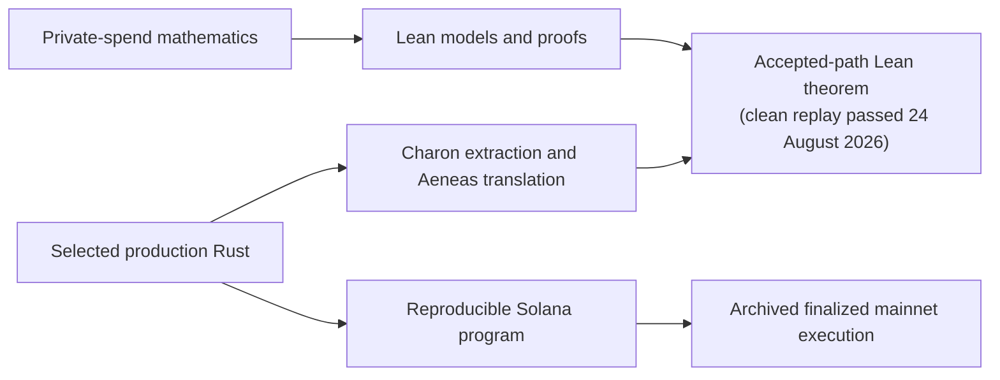

# How Aspis is formally checked

Aspis has two connected proof layers:

1. Lean proofs about the private-spend construction and its security
   calculation.
2. Lean proofs showing what one successful run of selected production Rust
   checked.

Those layers sit beside a reproducible build and the archived mainnet
execution. Each answers a different question.



The final two arrows are evidence about exact bytes and observed execution;
they are not a Lean proof of the compiler or Solana runtime.

## 1. The mathematical proof layer

[`AspisFormal/`](../AspisFormal/) contains the maintained Lean 4 project. Its
main checked results include:

- the private-spend rules, value balance, range conditions, ownership, note
  commitment, nullifier, both Merkle paths, asset, fee, and public output;
- the released circle groups and four encoders, including the field, domain,
  dimension, distance, degree, and query conditions used by the cited
  decoding result;
- the four linked FRI folds and one initial candidate list of at most 240
  candidates, rather than an independent list choice at every fold;
- the challenge-dependent nineteen-value batching argument;
- exact sampling of 18 distinct positions from at most 64 draws;
- the work checks and the finite work-normalized security calculation;
- group, masking, hiding, and value-conservation results; and
- known-answer Poseidon2 executions with the Rust constants pinned by CI.

The mathematical development has not found a contradictory parameter choice,
an invalid distance calculation, or an accepting false-proof construction.
The detailed theorem ledger is in
[`AspisFormal/README.md`](../AspisFormal/README.md).

### The security number

The release target is **100 bits of work-normalized attack cost**.

After an attacker has already completed the 37-bit grind, the dominant raw
batching term is only about 70--71 bits. The grind is not pointless: the
work-normalized experiment charges the attacker for producing those completed
attempts. Under the stated Fiat--Shamir and work assumptions, the checked core
is below `0.7 * 2^-100`. The remaining `0.3 * 2^-100` is reserved for
separately bounded external events.

Aspis therefore does **not** describe a completed proof as having a raw
`2^-100` false-acceptance probability. It reports a 100-bit work-normalized
target and states the raw post-grind figure separately. The final deterministic
selected-call theorem is not yet composed with the probability experiment:
that still requires one causal adversarial law, event inclusions for its
six-way result, the work-normalization connection, and concrete external
budgets.

### Published mathematical results used by Lean

Lean checks that the release parameters meet the hypotheses recorded for the
published circle-decoding and Fiat--Shamir results. It does not reprove those
papers from first principles. Their applicability to the precise construction
and their cryptographic conclusions remain cited inputs to the final security
argument.

The same distinction applies to SHA-256 and Poseidon2. Lean checks byte
framing, constants, known-answer executions, and how failure events are used.
It does not prove that either primitive is collision resistant, preimage
resistant, or a random oracle.

## 2. The production Rust proof layer

A correct model is not enough if the deployed checker implements different
rules. Aspis therefore follows selected Rust into Lean:

1. Charon extracts the selected Rust functions.
2. Aeneas translates the extracted control flow and data types into Lean.
3. Bridge proofs connect the generated definitions to the mathematical
   models.
4. The final aggregate theorem starts from a successful selected translated
   call to the released proof checker and builds the mathematical evidence
   from that same run.

The exact generated code and bridge proofs are under
[`aeneas-verif/`](../aeneas-verif/).

### What one accepted run currently establishes

Starting with a successful translated call to
`verify_mode9_composite_with_live_statement`, the checked source chain now
derives:

- the parsed body and live public statement;
- the transcript state and sampled field values;
- the batch, four fold, and final work checks, in order;
- the exact 18 distinct query positions;
- five Merkle-authenticated opening sections;
- the fact that the FRI checker reads those authenticated values;
- the coordinate calculations, four FRI folds, and final polynomial; and
- the exact 76 decoded point claims, the four prepared claims, and the initial
  relation value; and
- the complete 58-field relation tail and the four accepted relation rounds.

All of those witnesses come from one successful execution. The accepted
general-accumulator schedule is derived from its four initial components and
eight tensor additions, and every one of its twelve components is carried
through the production folds to the exact terminal weights and dot product.
The source and model semantics include the dense and deferred grouped cases.

The compact constructor, four folds, final assembly, and four-term dot are
also derived from the accepted execution. The final theorem uses both
accumulator equalities internally; callers do not provide either equality as
an assumption. Its clean tracked replay passed on 24 August 2026, so the same successful
selected translated verifier call deterministically yields the maintained
accepted-path security-event conclusion.

The exact publication theorem is
`AspisV5AcceptedOneRunDeterministicFinal.accepted_composite_security_conclusion_for_any_terminal_evaluator`
in `V5AcceptedOneRunDeterministicFinal.lean`.

Its terminal evaluator is arbitrary: the later relation and FRI security
reasoning does not consume the evaluator's returned value. The theorem
therefore constructs the terminal boundary internally by reflexivity rather
than asking the caller for an evaluator/model equality. It also installs the
exact released FRI tables internally.

One extraction boundary is recorded explicitly. The old handwritten compact
outer wrapper rebuilt the array from an empty terminal iterator, which
discarded its writes. Lean now includes a counterexample for that old wrapper
and a corrected wrapper that rebuilds from the updated original iterator. The
Rust and deployed program did not contain this error. An extended Aeneas
translation of the unchanged production function produces the corrected
iterator handback. The final proof connects that generated caller to the fold
semantics rather than assuming their equality.

The [extraction record](../aeneas-verif/v5-relation-acceptance-20260815/extraction/compact-fold-extended-20260824/)
pins the unchanged Rust file, Charon and Aeneas revisions, extraction-only
patches, LLBC hash, direct generated Lean, normalized generated Lean, and the
successful Lean 4.32 object hash. The direct output's mutable-array iterator
declaration is replaced by the existing exact slice/from-slice definition in
the recorded normalization; the normalized file contains no axiom or omitted
proof.

The [accepted-path source map](v5-accepted-source-map.md) gives a fifteen-stop
route through the production code and names the proof for each stop.

### What this source theorem does not cover

The selected path is the proof checker called by the released spend. It is not
a verification of every Rust function. In particular, the theorem does not
prove:

- the SHA-256 callback specification;
- the outer `AccountInfo` borrowing and Solana dispatch machinery;
- upload, seal, cleanup, refund, or wallet code;
- the Rust compiler, LLVM, the SBF toolchain, or the Solana runtime;
- Charon, Aeneas, Lean, or mathlib themselves; or
- the cryptographic security of SHA-256 or Poseidon2.

The proof assumes that Solana's SHA-256 call returns SHA-256 of exactly the
bytes passed to it. Solana account locking, rollback, PDA derivation, and
persistent marker writes are separate runtime assumptions.

## 3. Soundness: what is proved and what is assumed

The deterministic Lean argument classifies an accepted false statement into
explicit failure cases. The main checked parts are:

- a single linked FRI candidate passes through all four folds;
- the relation checker uses the same challenges, prepared claims, and final
  polynomial as the FRI checker;
- the opened values come from the five authenticated sections unless a
  SHA-256 Merkle collision occurs;
- a false statement reaches a listed FRI, trace, relation, hash, transcript,
  or primitive failure event; and
- the finite relation-repair and work-normalized arithmetic meet the released
  bounds when the external event bounds are supplied.

The final one-run theorem passed its clean replay on 24 August 2026. No caller-supplied
main-accumulator, compact-accumulator, or final-composition equality remains.
The boundaries that remain are cryptographic and platform claims that a
deterministic source theorem cannot prove:

- the cited decoding, polynomial-commitment, and Fiat--Shamir results;
- SHA-256 and Poseidon2 implementation and security properties;
- fresh prover randomness;
- the lift from this deterministic one-call classification into the
  probability experiment used by the conditional 100-bit theorem;
- numerical bounds for extraction, hash, random-oracle, and other external
  failure events;
- the translation and compilation toolchain; and
- Solana account and state semantics.

There is also one explicit model-connection task. The translated Rust checks
that its live statement matches its statement digest, but the current theorem
does not identify those Rust statement fields one-by-one with the abstract
public statement used by the mathematical false-acceptance and theft models.
This prevents claiming a complete deployed-theft theorem even though the
selected accepting verifier execution is connected through both final
accumulators.

The exact list, use, evidence, and consequence of failure are in the
[`assumptions ledger`](assumptions-ledger.md).

## 4. Theft resistance

The theft proofs avoid the false claim that a compressing hash is one-to-one.
For a fixed victim, Lean separates:

1. extractor failure;
2. recovery of the victim's credential;
3. a second input for the victim's nullifier;
4. a second opening for the victim's note commitment;
5. a Merkle node-hash collision at the victim's position;
6. marker-address behavior;
7. a Solana runtime or state failure; and
8. invalid victim setup.

`ApplicationMerkleBinding.lean` proves that changing the leaf at the victim's
fixed position while preserving the root exposes a concrete node-hash
collision. `V5NullifierMarkerReplay.lean` proves in the maintained sequential
state model that a marker address cannot be consumed successfully twice,
even if two different nullifiers were to resolve to it.

These are useful reductions, but the repository does not claim an
unconditional numerical deployed theft bound. Such a number still depends on
knowledge extraction after observed proofs, fixed-target Poseidon2 security,
Merkle collision security, and the real Rust/Solana state transition following
the maintained state model.

## 5. Trusted proof checker

The audited deterministic theorems report only Lean/mathlib's standard
foundations:

```text
propext
Classical.choice
Quot.sound
```

The maintained proof sources are checked for `sorry`, `admit`, custom axioms,
`native_decide`, and compiled-evaluation shortcuts. External cryptographic
claims are theorem inputs or named boundaries; they are not hidden Lean
axioms.

## 6. Program and mainnet evidence

The formal proof is connected to the release by two further records:

- the [V5 preflight](../release/preflight/v5-production-freeze.md) reproduces
  the exact 1,258,496-byte SBF from pinned source and tools; and
- the [V5 mainnet bundle](../release/aspis-v5-tag67-mainnet-v1/) records the
  proof, statement, program identity, transaction, compute use, state change,
  cleanup, and refund.

The proof account and ProgramData were closed after the demonstration. The
[payer RPC archive](../release/aspis-v5-tag67-mainnet-rpc-archive-v1/)
therefore preserves the full finalized transaction history and reconstructs
the uploaded proof and deployed bytes offline. This is historical and build
evidence, not a proof of the compiler or runtime.

## Reproduce the evidence

### Mathematical proofs

```sh
cd AspisFormal
lake exe cache get
lake build
```

### Accepted Rust-to-Lean path

Use the Lean 4.32 checkpoint replay under
`aeneas-verif/v5-result-aware-source-link-20260821/`. The final tracked entry
point checks the theorem from one successful selected translated verifier call
to the maintained accepted-path security-event conclusion. A clean replay of
all 331 tracked closure modules passed on 24 August 2026. The every-commit formal CI uses the
pinned Aeneas compatibility environment.

### Program identity

```sh
./release/aspis-v5-tag67-frozen-candidate-v1/verify.sh
```

### Archived mainnet result

```sh
./release/aspis-v5-tag67-mainnet-v1/verify.sh
python3 tools/check_release_facts.py
```

The finalized verification transaction is
[`EJviPgF…R3vJ2fE`](https://explorer.solana.com/tx/EJviPgF12i9iK2CveVaQSMeFQqDMFPQ1iPRUYEwNQE3zGquTUZNJXPZEENorcQtsnQj1orFmH1TPsgdbR3vJ2fE?cluster=mainnet-beta).
