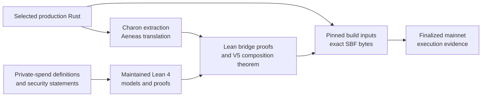

# How Aspis is formally checked

Aspis V5 combines mathematical proofs, implementation proofs, reproducible
build evidence, and finalized chain evidence. These are different claims, so
the repository keeps their boundaries visible.



The arrows do not mean that one proof automatically covers the next layer.
They identify the evidence used to connect adjacent layers.

## Layer 1: the mathematical development

[`AspisFormal/`](../AspisFormal/) is the maintained Lean 4 project. It checks
substantial parts of the construction, including:

- the private-spend relation, value conservation, range conditions,
  commitment clauses, and Merkle clauses;
- the concrete release arithmetic and work-normalized security calculations;
- circle-group, masking, and hiding results;
- known-answer executions over the pinned Poseidon2 constants, with CI binding
  the same constants to Rust;
- maintained models for V5 Components A, B, and C; and
- the 17-attempt production retry controller and nonce/work authentication.

The detailed [`AspisFormal` proof-status
table](../AspisFormal/README.md) names the principal module for each result and
separates proved conclusions from named cryptographic inputs.

The audited integration theorems use Lean and mathlib's standard logical base,
`{propext, Classical.choice, Quot.sound}`. The maintained project contains no
`sorry`, custom axiom, `native_decide`, or compiled-evaluation shortcut.

## Layer 2: selected production Rust

A mathematical model can be correct while its implementation is wrong. Aspis
therefore connects selected production V5 Rust to Lean:

1. Charon extracts the selected Rust definitions.
2. Aeneas translates the extracted definitions into Lean.
3. Lean bridge proofs relate the generated definitions to the maintained
   Aspis models.
4. A final composition theorem joins the selected V5 component results.

The exact extraction snapshots, generated Lean, bridge modules, tool
revisions, and theorem map are under
[`aeneas-verif/`](../aeneas-verif/).

### Current V5 coverage

| Selected production scope | Checked connection | Principal theorem |
| --- | --- | --- |
| Component A release schedule | Extracted matrix execution agrees with the maintained GoodA model for the selected schedule | `FormalClosureStream1.component_a_actual_matches_maintained` |
| Component B | Generated sampler, evaluator, and C2 layout agree with the ten-round model | `FormalClosureStream1.component_b_actual_matches_maintained` |
| Component C | Four runtime rounds, finalization, packer, and public rows agree with the deployed evaluator model | `generated_public_run_output_matches_deployed` |
| Tag-67 work bytes | Generated guards and little-endian reads construct the work view used in Lean | `AspisTag67WorkVerifierClosure.tag67AcceptedWireAndVerifierClosure` |
| Ordered work verification | The proof-facing chain preserves batch, four fold, and final check order | `AspisTag67WorkVerifierClosure.tag67AcceptedWireAndVerifierClosure` |
| Final selected composition | Packages A, B, C public output, and Tag-67 work verification under their stated hypotheses | `FormalClosureStream1.current_source_combined_capstone` |

Principal source files:

- [`CurrentSourceABCapstone.lean`](../aeneas-verif/current-source-abc-capstone-20260722/proof/CurrentSourceABCapstone.lean)
- [`RuntimeReleasedTraceFamiliesCurrentJoin.lean`](../aeneas-verif/component-c-runtime-downstream/released-trace-families-current-20260722/proof/RuntimeReleasedTraceFamiliesCurrentJoin.lean)
- [`Tag67WorkVerifierClosure.lean`](../aeneas-verif/tag67-work-wire-correspondence/proof/Tag67WorkVerifierClosure.lean)

Pinned Aeneas cannot translate the production `Transcript` function-pointer
field directly. The six-step control-flow proof therefore uses a small
proof-facing Rust helper supplied with the six booleans computed by the
production digest checks. Separate theorems establish the digest predicate and
ordered checks.

## The remaining Tag-67 hash-call premise

The selected Tag-67 Rust-to-model theorem retains this explicit premise:

```text
∀ state nonce,
  actualTranscriptGrindingDigest state nonce =
    rustHash state ((3 : Byte) :: List.ofFn (nonceLEBytes nonce))
```

In plain language, the actual transcript hash call must equal the Lean hash
interface applied to the transcript state, the `DOM_GRIND` byte `3`, and the
little-endian nonce.

Given that premise and successful generated guards and reads, the exact
projection, leading-zero predicate, and six ordered work checks are theorem
conclusions. SHA-256 security itself is a cryptographic assumption, not a Lean
conclusion.

## What the final theorem does not claim

`FormalClosureStream1.current_source_combined_capstone` connects the selected
Component A, B, C, public-output, and Tag-67 work paths. It is not:

- an end-to-end proof of every prover or verifier Rust function;
- a proof of every parser, account-validation, lifecycle, executor, or cleanup
  path;
- a verification of Charon, Aeneas, `rustc`, LLVM, the Solana toolchain, or
  the Agave runtime;
- a proof that SHA-256 or Poseidon2 has the assumed cryptographic security; or
- a proof of network privacy, timing privacy, wallet behavior, or physical
  side-channel resistance.

The Component-A result is scoped to the selected release schedule. Components
B and C and the work-byte results have the broader but still explicit scopes
listed in their theorem ledgers.

The complete trusted and assumed boundary is maintained in the
[assumptions ledger](assumptions-ledger.md).

## Layers 3 and 4: exact program and chain evidence

Formal correspondence is connected to deployment through two reproducibility
records:

1. The [V5 preflight](../release/preflight/v5-production-freeze.md) binds a
   pinned clean source commit and pinned tools to the exact 1,258,496-byte SBF,
   SHA-256
   `4cf3c1d5ddd47efa68875c0070247e007083c5c9bb2d5988db0d644a609edf40`.
2. The [V5 mainnet bundle](../release/aspis-v5-tag67-mainnet-v1/) binds that
   SBF identity to the published proof, statement, finalized Tag-67
   transaction, compute result, state transition, and cleanup receipts.

The finalized mainnet transaction is
[`EJviPgF…R3vJ2fE`](https://explorer.solana.com/tx/EJviPgF12i9iK2CveVaQSMeFQqDMFPQ1iPRUYEwNQE3zGquTUZNJXPZEENorcQtsnQj1orFmH1TPsgdbR3vJ2fE?cluster=mainnet-beta).
It used canonical nullifier PDA bump 255 and consumed 1,334,452 CU in both
exact signed-wire simulation and landed metadata.

These records do not turn the compiler or runtime into proved code. They make
the exact trusted bytes and observed execution reproducible and reviewable.

## Reproduce the four layers

### 1. Mathematical Lean proofs

```sh
cd AspisFormal
lake exe cache get
lake build
```

### 2. Selected Rust-to-Lean proofs

From the repository root:

```sh
aeneas-verif/component-c-runtime-downstream/released-trace-families-current-20260722/replay-lean432.sh
aeneas-verif/current-source-abc-capstone-20260722/replay-lean432.sh
```

The replay uses Lean 4.32 default limits and the authenticated dependency
caches described in the
[`aeneas-verif` replay notes](../aeneas-verif/README.md#replaying-the-final-integration).

### 3. Frozen program identity

```sh
./release/aspis-v5-tag67-frozen-candidate-v1/verify.sh
```

Follow the preflight for the pinned byte-for-byte rebuild environment.

### 4. Finalized mainnet lifecycle

```sh
./release/aspis-v5-tag67-mainnet-v1/verify.sh
python3 tools/check_release_facts.py
```

These checks verify published files and invariants offline. Chain finality is
recorded in the sanitized lifecycle evidence and linked from the
[V5 mainnet record](v5-mainnet-demo.md).
